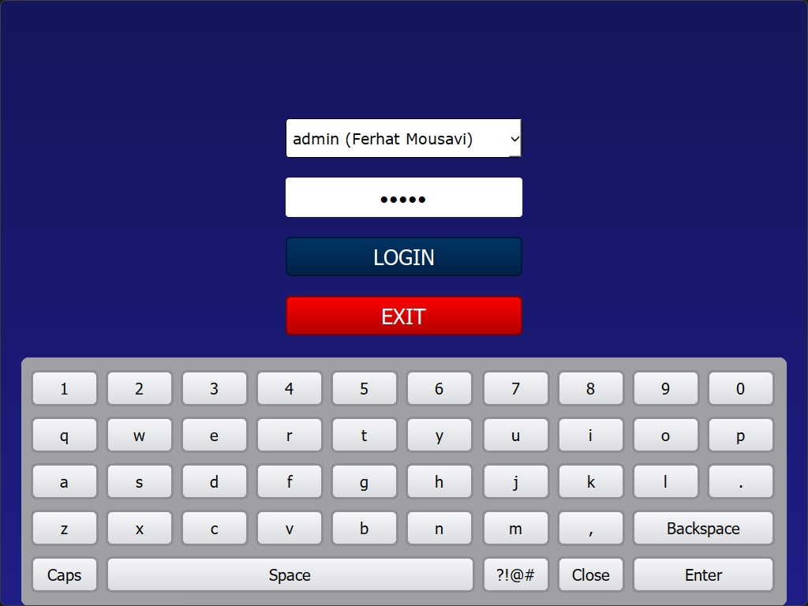
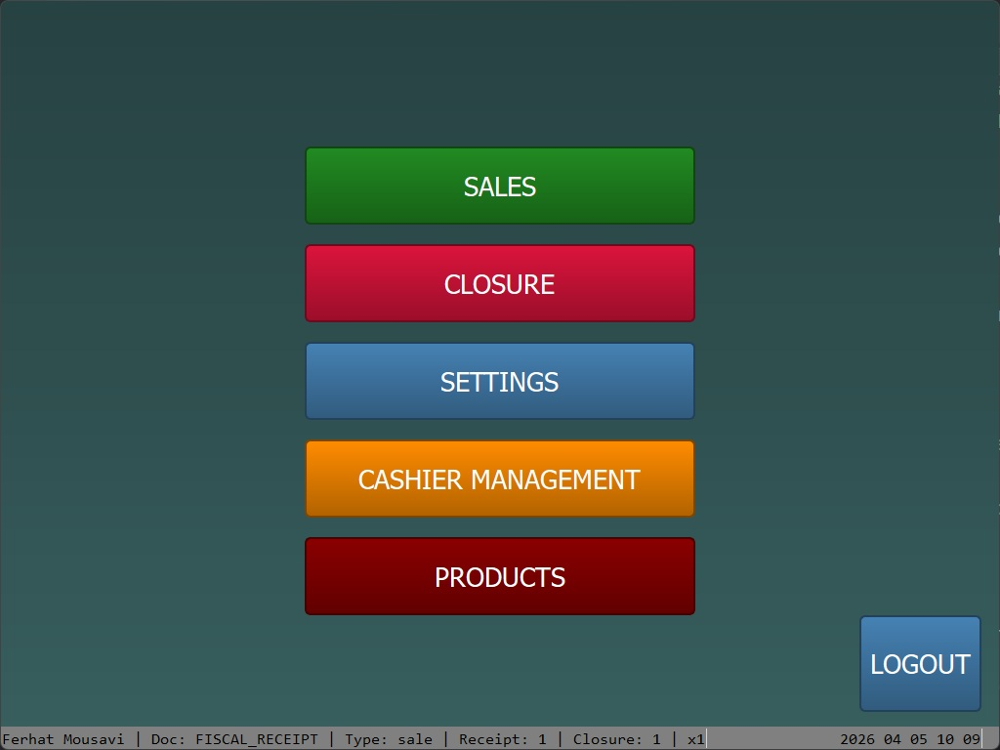
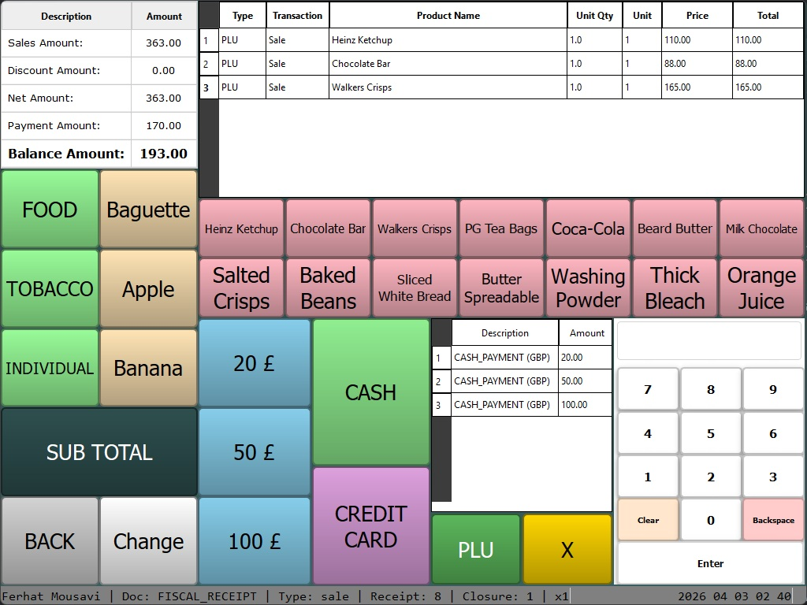

> **Under development. The project is not working properly yet.**
> **Current Version: 1.0.0b3 (Beta)**


# SaleFlex.PyPOS

### Touch Screen Point-of-Sale Application

SaleFlex.PyPOS is a modern, Python-based point-of-sale (POS) system designed for retail businesses, restaurants, and service-oriented establishments. Built with PySide6 (Qt framework), it offers a touch-optimized interface with cross-platform compatibility and robust database support.

## Key Features

SaleFlex.PyPOS POS system is designed to streamline the sales process and improve efficiency with these capabilities:

- **Multi-Payment Processing**: Accept cash, credit cards, debit cards, and mobile payments
- **Receipt & Invoice Generation**: Automated transaction documentation with ESC/P printer support
- **Inventory Management**: Real-time stock tracking with low-stock alerts
- **Customer Management**: Store customer information, preferences, and purchase history
- **Analytics & Reporting**: Comprehensive sales, inventory, and customer behavior analytics
- **System Integration**: Connect with accounting software, warehouse management, and ERP systems
- **️Returns & Exchanges**: Handle product returns and exchanges efficiently
- **Employee Management**: Track employee time, attendance, and performance
- **Campaign & Promotion Management**: Flexible promotional campaigns with time-based, product-specific, and basket discounts
- **Loyalty Programs**: Tiered membership rewards system with points earning, redemption, and customer segmentation
- **Country-Specific Closure Templates**: Flexible template system for country-specific closure data (E-Fatura for Turkey, state tax for USA, VAT reporting for EU, etc.) stored as JSON templates in `static_files/closures/` directory
- **Region Support**: `CountryRegion` model tracks sub-country regions (states, provinces, special economic zones) with ISO 3166-2 compliant fields. Includes 80+ pre-populated regions for region-specific closure templates and compliance
- **Active Closure Management**: Session-based closure tracking system that automatically loads open closures at startup and manages closure lifecycle (open → active → closed). Closure data is maintained in memory during operations and saved to database when closed
- **Document Management System**: Complete transaction lifecycle management with temporary models during processing and automatic conversion to permanent models upon completion. Automatically updates document data during sales operations (PLU and department sales). Supports document suspension/resumption for restaurant mode (table/order management) and automatic recovery of incomplete transactions at startup. Automatically restores sale screen UI controls (sale_list, amount_table, payment_list) when entering sale screen with ACTIVE transaction status, enabling seamless resumption of incomplete transactions
- **Auto-Save Functionality**: Automatic database persistence system using descriptor pattern and wrapper classes. Model instances and dictionaries are automatically saved to the database when attributes are modified, ensuring data integrity and reducing manual save operations. Supports nested model wrapping and skip flags for batch operations
- **Optimized Performance**: In-memory caching of reference data (`pos_data`) and product data (`product_data`) minimizes disk I/O, extending disk life for POS devices with limited write cycles. All product lookups, currency calculations, VAT rate lookups, button rendering, and sale operations use cached data instead of database queries

## Architecture Overview

SaleFlex.PyPOS follows a layered architecture pattern with clear separation of concerns:

- **Application Layer** (`pos/manager/application.py`): Main application class implementing Singleton pattern, combining CurrentStatus, CurrentData, and EventHandler
- **Business Logic Layer** (`pos/service/`): Service classes (VatService, SaleService, PaymentService) for centralized business operations
- **Event Handling Layer** (`pos/manager/event/`): 9 specialized event handler classes for modular event processing. Event handler methods use `_event` suffix naming convention (e.g., `_sales_form_event`, `_closure_event`) to distinguish them from properties
- **Data Access Layer** (`data_layer/model/`): 98+ SQLAlchemy models with CRUD operations and auto-save functionality
- **UI Layer** (`user_interface/`): PySide6-based UI components with dynamic form rendering
- **Caching Layer** (`pos/manager/cache_manager.py`): In-memory caching for reference and product data

## Project Structure

```
SaleFlex.PyPOS/
├── saleflex.py              # Main application entry point
├── requirements.txt         # Python dependencies
├── settings.toml           # Application configuration
├── db.sqlite3              # Default SQLite database
├── PyPOS_GUIDE.md          # Quick reference guide (redirects to docs/)
│
├── docs/                   # Comprehensive documentation
│   ├── README.md           # Documentation index
│   └── *.md                # Topic-specific documentation files
│
├── data_layer/             # Database & ORM Layer
│   ├── engine.py           # Database engine configuration
│   ├── db_initializer.py   # Database initialization
│   ├── db_manager.py       # Database management utilities
│   ├── db_utils.py         # Database helper functions
│   │
│   ├── auto_save/          # Auto-save functionality
│   │   ├── auto_save_model.py
│   │   ├── auto_save_dict.py
│   │   └── auto_save_descriptor.py
│   │
│   ├── db_init_data/       # Initial data seeding
│   │   ├── cashier.py
│   │   ├── country.py
│   │   ├── currency.py
│   │   ├── product.py
│   │   └── ...             # Other initialization modules
│   │
│   ├── enums/              # Enumeration definitions
│   │   ├── control_name.py
│   │   ├── control_type.py
│   │   ├── custom_control_type_name.py
│   │   ├── event_name.py
│   │   └── form_name.py
│   │
│   └── model/              # Data models and CRUD operations
│       ├── crud_model.py   # Base CRUD operations
│       ├── mixins.py       # Model mixins
│       └── definition/     # Entity definitions (98+ models)
│
├── user_interface/         # UI Components
│   ├── window/             # Application windows and dialogs
│   │   ├── base_window.py
│   │   └── dynamic_dialog.py
│   │
│   ├── control/            # Custom UI controls
│   │   ├── button.py
│   │   ├── textbox.py
│   │   ├── combobox.py
│   │   ├── label.py
│   │   ├── datagrid.py
│   │   ├── panel.py        # Panel control with scrollbar support
│   │   ├── toolbar.py
│   │   ├── statusbar.py
│   │   ├── amount_table/   # Amount table control
│   │   ├── numpad/         # Numeric pad control
│   │   ├── payment_list/   # Payment list control
│   │   ├── sale_list/      # Sale list control
│   │   ├── transaction_status/  # Transaction status display
│   │   └── virtual_keyboard/    # Virtual keyboard component
│   │
│   ├── form/               # Form definitions
│   │   ├── about_form.py
│   │   └── message_form.py
│   │
│   ├── render/             # Dynamic form rendering (database-driven)
│   │   └── dynamic_renderer.py
│   │
│   └── manager/            # UI management logic
│       └── interface.py
│
├── pos/                    # Core POS Business Logic
│   ├── data/               # POS-specific data types
│   │   ├── document_type.py
│   │   ├── document_state.py
│   │   ├── payment_type.py
│   │   └── discount_type.py
│   │
│   ├── hardware/           # Hardware integration
│   │   └── device_info.py  # Device information detection
│   │
│   ├── service/            # Business logic services
│   │   ├── vat_service.py     # VAT calculation service
│   │   ├── sale_service.py    # Sale processing service
│   │   └── payment_service.py # Payment processing service
│   │
│   └── manager/            # Application management
│       ├── application.py  # Main application class
│       ├── current_data.py # Current session data
│       ├── current_status.py
│       ├── cache_manager.py      # Data caching
│       ├── closure_manager.py    # Closure management
│       ├── document_manager.py   # Document lifecycle
│       ├── event_handler.py      # Event handling (combines all event handlers)
│       └── event/          # Event handlers (9 specialized event handler classes)
│           ├── general.py        # GeneralEvent: Login, logout, exit, navigation
│           ├── sale.py           # SaleEvent: Sales transaction and product events
│           ├── payment.py        # PaymentEvent: Payment processing events
│           ├── closure.py        # ClosureEvent: End-of-day closure operations
│           ├── configuration.py  # ConfigurationEvent: Settings and configuration
│           ├── service.py        # ServiceEvent: Service-related operations
│           ├── report.py         # ReportEvent: Report generation and viewing
│           ├── hardware.py       # HardwareEvent: Hardware device operations
│           └── warehouse.py      # WarehouseEvent: Warehouse and inventory operations
│
├── settings/               # Configuration management
│   └── settings.py
│
├── static_files/           # Static assets
│   ├── closures/           # Country-specific closure templates
│   │   ├── tr.json
│   │   ├── usa.json
│   │   ├── usa_ca.json
│   │   └── ...
│   └── images/             # Image assets
│       ├── saleflex.ico
│       └── ...
```

## Business Applications

SaleFlex.PyPOS is designed to meet the diverse needs of various business types:

- **Retail Stores**: Complete retail management with inventory, customer tracking, and sales analytics
- **Fast Food Restaurants**: Quick service restaurant operations with order management
- **Chain Restaurants**: Multi-location restaurant management with centralized control
- **Service Businesses**: Various service-oriented establishments with customizable workflows

## SaleFlex.GATE Integration

SaleFlex.PyPOS integrates seamlessly with **[SaleFlex.GATE](https://github.com/SaleFlex/SaleFlex.GATE)** - a Django-based centralized management system:

- **Centralized Management**: Monitor and manage multiple POS systems from one dashboard
- **Cloud-Based Access**: Remote control and monitoring for business owners and managers
- **ERP Integration**: Seamless data synchronization with existing ERP systems
- **Scalable Architecture**: Support growing businesses with multiple locations
- **Secure Data Flow**: Robust API-based communication between POS terminals and backend

## System Requirements

### Hardware Requirements
- **Devices**: Linux/Windows supported touch screen devices
- **Displays**: Single or dual display configurations
- **Printers**: ESC/P compatible receipt printers
- **Scanners**: 2D and 3D barcode readers
- **Scales**: Weighing scales for retail environments

### Software Requirements
- **Python**: 3.13 or higher
- **PySide6**: 6.10.0 (Qt-based GUI framework)
- **SQLAlchemy**: 2.0.44 (ORM for database operations)
- **Requests**: 2.32.5 (HTTP client for API communications)

### Supported Database Engines
- **SQLite** (default, included)
- **PostgreSQL**
- **MySQL**
- **Oracle**
- **Microsoft SQL Server**
- **Firebird**
- **Sybase**

## Installation & Setup

### Prerequisites
1. Install [Python 3.13](https://www.python.org/downloads/) or higher
2. Ensure pip is installed and up to date

### Installation Steps

1. **Clone or Download** the SaleFlex.PyPOS project:
   ```bash
   git clone https://github.com/SaleFlex/SaleFlex.PyPOS.git
   cd SaleFlex.PyPOS
   ```

2. **Create Virtual Environment**:
   ```bash
   python3 -m venv venv
   ```

3. **Activate Virtual Environment**:
   
   **Windows:**
   ```cmd
   venv\Scripts\activate.bat
   ```
   
   **macOS/Linux:**
   ```bash
   source venv/bin/activate
   ```

4. **Install Dependencies**:
   ```bash
   pip install -r requirements.txt
   ```

5. **Run the Application**:
   ```bash
   python saleflex.py
   ```

### First Login

After running the application, you will see the login screen:



**Default Login Credentials:**
- **Username**: `admin`
- **Password**: `admin`

After successful login, you will be redirected to the main menu:



If you select "SALES", you will see a form as shown below:



### Configuration
- Edit `settings.toml` to configure database connections and basic application settings
- **Note**: Many POS settings (hardware ports, display settings, backend connections) are now managed through the database (`PosSettings` model) and can be configured via the application UI or API
- The application uses SQLite by default, stored in `db.sqlite3`
- Device information (serial number, OS) is automatically detected and stored on first initialization

### Database Models Overview

The application includes **98+ database models** organized into logical categories:

- **Core System**: Cashier, Store, Table, Country, CountryRegion, City, District
- **Currency & Payment**: Currency, CurrencyTable, PaymentType, ClosureCurrency
- **Product Management**: Product, ProductVariant, ProductAttribute, ProductBarcode, ProductUnit, ProductManufacturer, DepartmentMainGroup, DepartmentSubGroup
- **Transaction Models**: TransactionHead/HeadTemp, TransactionProduct/ProductTemp, TransactionPayment/PaymentTemp, TransactionDiscount/DiscountTemp, TransactionTax/TaxTemp, TransactionTip/TipTemp, TransactionDepartment/DepartmentTemp, TransactionDelivery/DeliveryTemp, TransactionNote/NoteTemp, TransactionRefund/RefundTemp, TransactionSurcharge/SurchargeTemp, TransactionFiscal/FiscalTemp, TransactionKitchenOrder/KitchenOrderTemp, TransactionLoyalty/LoyaltyTemp, TransactionChange/ChangeTemp, TransactionVoid, TransactionLog, TransactionSequence, TransactionDocumentType, TransactionDiscountType, TransactionStatus
- **Warehouse Management**: Warehouse, WarehouseLocation, WarehouseProductStock, WarehouseStockMovement, WarehouseStockAdjustment
- **Customer Management**: Customer, CustomerSegment, CustomerSegmentMember
- **Campaign & Promotion**: CampaignType, Campaign, CampaignRule, CampaignProduct, CampaignUsage, Coupon, CouponUsage
- **Loyalty Programs**: LoyaltyProgram, LoyaltyTier, CustomerLoyalty, LoyaltyPointTransaction
- **Cashier Performance**: CashierWorkSession, CashierWorkBreak, CashierPerformanceMetrics, CashierPerformanceTarget, CashierTransactionMetrics
- **Closure & Reporting**: Closure, ClosureCashierSummary, ClosureCurrency, ClosureDepartmentSummary, ClosureDiscountSummary, ClosureDocumentTypeSummary, ClosurePaymentTypeSummary, ClosureTipSummary, ClosureVATSummary, ClosureCountrySpecific
- **Form & UI**: Form, FormControl (supports parent-child relationships for Panel controls with generic model form pattern), PosSettings, PosVirtualKeyboard, ReceiptHeader, ReceiptFooter, LabelValue

All models support:
- **UUID Primary Keys**: Unique identifiers for all records
- **CRUD Operations**: Base CRUD class provides create, read, update, delete operations
- **Audit Trails**: Created/updated timestamps and user tracking
- **Soft Delete**: Records can be marked as deleted without physical removal
- **Auto-Save**: Automatic database persistence when attributes are modified

## Development Roadmap

### Core Infrastructure
- [x] **Project Structure** - Basic application framework
- [x] **Database Layer** - SQLAlchemy ORM integration with 98+ models
- [x] **Database Structure** - POS data layer structure with comprehensive model definitions
- [x] **UI Foundation** - PySide6 interface framework
- [x] **Auto-Save System** - Automatic database persistence with descriptor pattern
- [ ] **Configuration Management** - Advanced settings system
- [ ] **Logging & Monitoring** - Comprehensive logging and error tracking

### POS Core Modules
- [x] **POS Manager Module** - Central business logic and transaction handling with document management system
- [x] **Document Management System** - Transaction lifecycle management with temp/permanent models, pending documents, and restaurant mode support
- [x] **Service Layer Architecture** - Business logic services (VatService, SaleService, PaymentService) for centralized calculations and operations
- [x] **Payment Processing System** - Multi-payment method processing with button name parsing, change calculation, and automatic document completion
- [x] **Event Handler System** - Comprehensive event handling with 9 specialized event handler classes (GeneralEvent, SaleEvent, PaymentEvent, ClosureEvent, ConfigurationEvent, ServiceEvent, ReportEvent, HardwareEvent, WarehouseEvent) for modular and maintainable code organization. All event handler methods use `_event` suffix (e.g., `_sales_form_event`, `_closure_event`) to avoid conflicts with properties
- [x] **Auto-Save System** - Automatic database persistence using descriptor pattern and wrapper classes (AutoSaveModel, AutoSaveDict, AutoSaveDescriptor) for seamless data integrity
- [ ] **SPU/PLU Management** - Product and pricing management
- [ ] **Customer Module** - Customer relationship management
- [ ] **Printer Module** - Receipt and invoice printing
- [ ] **Inventory Management** - Real-time stock tracking and control
- [ ] **Tax & Discount Engine** - Advanced tax calculation and discount management

### Hardware Integration
- [ ] **Payment Device Integration**:
  - [ ] Card Reader Support (Chip & PIN, Contactless)
  - [ ] Mobile Payment Integration (Apple Pay, Google Pay)
  - [ ] Cash Drawer Control
  - [ ] PIN Pad Integration
- [ ] **Peripheral Device Support**:
  - [ ] Barcode Scanner Integration
  - [ ] Electronic Scale Integration
  - [ ] Receipt Printer Drivers
  - [ ] Display Pole Integration
- [ ] **Hardware Abstraction Layer** - Unified hardware communication interface

### User Interface
- [x] **Panel Control** - Scrollable container control with parent-child support for complex forms
- [x] **Parent-Child Control Relationships** - Panel controls can contain child controls (textboxes, labels, buttons)
- [x] **Generic Panel-Based Form Saving** - Automatic model updates from panel textbox values on SAVE button click. Works with any model via naming convention (panel name = model name, textbox name = model field). Automatically loads model data into form and saves changes to database
- [ ] **Dynamic Interface Interpreter** - Flexible UI rendering system
- [ ] **Interface Functions** - Core UI interaction handlers
- [ ] **Tables Layout Module** - Restaurant table management
- [ ] **Screen Designer App** - Custom interface design tool
- [ ] **Multi-Display Support** - Customer and cashier display management
- [x] **Touch Optimization** - Enhanced touch screen experience with 30px scrollbars for Panel controls

### Business Features
- [ ] **Campaign & Promotion Management**:
  - [ ] Multiple Campaign Types (Product Discount, Basket Discount, Time-Based, Buy X Get Y, Welcome Bonus)
  - [ ] Flexible Discount Rules (Percentage, Fixed Amount, Free Product)
  - [ ] Time-Based Restrictions (Date Range, Daily Hours, Days of Week)
  - [ ] Product/Category/Brand/Payment Type Filters
  - [ ] Usage Limits & Priority Rules
  - [ ] Customer Segment Targeting
  - [ ] Coupon Generation & Management (QR Code, Barcode Support)
  - [ ] Campaign Usage Tracking & Analytics
- [ ] **Loyalty Program Management**:
  - [ ] Points Earning & Redemption Rules
  - [ ] Point Expiry Management
  - [ ] Tiered Membership System (Bronze, Silver, Gold, Platinum)
  - [ ] Welcome & Birthday Bonus Points
  - [ ] Tier-Based Benefits (Points Multiplier, Automatic Discounts)
  - [ ] Complete Point Transaction History
  - [ ] Customer Segmentation (VIP, New, Frequent, High Value, Inactive, Birthday)
  - [ ] GDPR Compliant Consent Management
- [ ] **Reports Module** - Comprehensive business analytics
- [ ] **Employee Management** - Staff scheduling and performance tracking
- [ ] **Returns & Exchanges** - Product return and exchange handling
- [ ] **Multi-Store Support** - Chain store management capabilities

### Warehouse & Inventory Management
- [ ] **Advanced Inventory Control**:
  - [ ] Real-time Stock Tracking
  - [ ] Multi-Location Inventory Management
  - [ ] Stock Transfer Between Locations
  - [ ] Automatic Reorder Points & Alerts
- [ ] **Warehouse Operations**:
  - [ ] Goods Receiving & Put-away
  - [ ] Pick & Pack Operations
  - [ ] Cycle Counting & Physical Inventory
  - [ ] Batch & Serial Number Tracking
- [ ] **Supply Chain Management**:
  - [ ] Vendor Management & Purchase Orders
  - [ ] Supplier Performance Analytics
  - [ ] Automated Procurement Workflows
  - [ ] Cost Analysis & Optimization
- [ ] **Inventory Analytics**:
  - [ ] ABC Analysis (Fast/Slow Moving Items)
  - [ ] Demand Forecasting
  - [ ] Inventory Turnover Reports
  - [ ] Wastage & Shrinkage Tracking

### Sector-Specific Features
- [ ] **Restaurant Management**:
  - [ ] Recipe & Ingredient Management
  - [ ] Kitchen Display System (KDS)
  - [ ] Table Management & Reservations
  - [ ] Menu Engineering & Cost Analysis
  - [ ] Food Safety & Expiration Tracking
- [ ] **Retail Store Management**:
  - [ ] Category & Brand Management
  - [ ] Size & Color Variations
  - [ ] Seasonal Pricing & Promotions
  - [ ] Customer Shopping Behavior Analytics
  - [ ] Planogram & Shelf Management
- [ ] **Fashion & Boutique**:
  - [ ] Size Matrix & Style Variations
  - [ ] Fashion Season Management
  - [ ] Consignment & Vendor Management
  - [ ] Trend Analysis & Buying Recommendations
  - [ ] Alteration & Custom Order Tracking
- [ ] **Grocery & Supermarket**:
  - [ ] Fresh Produce Management
  - [ ] Deli & Bakery Operations
  - [ ] Bulk Item Management
  - [ ] Supplier & Private Label Management
  - [ ] Perishable Item Rotation (FIFO/LIFO)

### Integration & Connectivity
- [ ] **SaleFlex.GATE Integration**:
  - [ ] Data Synchronization Service
  - [ ] ERP Connection Layer
  - [ ] Multi-Store Management
  - [ ] Cloud-Based Remote Access
  - [ ] Real-time Analytics Dashboard
- [ ] **Third-Party Integrations**:
  - [ ] Accounting Software APIs
  - [ ] E-commerce Platform Sync
  - [ ] Warehouse Management Systems
  - [ ] External Payment Gateways
- [ ] **Offline/Online Mode** - Seamless switching between online and offline operations

### Security & Authentication
- [ ] **User Authentication System** - Multi-level user access control
- [ ] **Data Encryption** - Secure data storage and transmission
- [ ] **Audit Trail** - Comprehensive transaction logging
- [ ] **Role-Based Access Control** - Granular permission management
- [ ] **PCI DSS Compliance** - Payment industry security standards

### Performance & Scalability
- [x] **In-Memory Data Caching** - Reference data (`pos_data`) and product data (`product_data`) loaded once at startup to minimize disk I/O
- [x] **Product Data Cache** - All product-related models (including Currency, CurrencyTable, and Vat) cached in memory for fast sale operations, currency calculations, VAT lookups, and button rendering
- [x] **Active Closure Management** - Current closure data maintained in session memory (`CurrentData.closure`) with automatic loading at startup and lifecycle management (open → active → closed)
- [x] **Auto-Save Optimization** - Automatic database persistence reduces manual save operations and ensures data integrity without performance overhead
- [ ] **Database Optimization** - Query optimization and indexing
- [ ] **External Caching Layer** - Redis/Memcached integration (optional)
- [ ] **Load Testing** - Performance testing under high load
- [x] **Memory Management** - Efficient resource utilization via pos_data and product_data caches
- [ ] **Concurrent Transaction Handling** - Multi-terminal support

### Data Management
- [ ] **Data Migration Tools** - Database upgrade and migration utilities
- [ ] **Backup & Recovery** - Automated backup and restore systems
- [ ] **Data Export/Import** - CSV, Excel, and API data exchange
- [ ] **Data Archiving** - Long-term data storage solutions

### Localization & Compliance
- [ ] **Multi-Language Support** - Internationalization (i18n)
- [x] **Currency Support** - Multi-currency handling with exchange rate tracking
- [x] **Tax Compliance** - Country-specific tax regulations with VAT/tax rate management
- [ ] **Fiscal Printer Support** - Government-mandated receipt requirements
- [x] **Local Regulations** - Region-specific compliance features via `ClosureCountrySpecific` model with template-based initialization (supports Turkey E-Fatura, USA state taxes, EU VAT reporting, etc.)
- [x] **Region Management** - `CountryRegion` model for tracking states/provinces/special zones with ISO 3166-2 compliant fields. Includes 80+ pre-populated regions (US states, CA provinces, DE states, FR regions) and integration with closure templates
- [x] **ISO 3166 Compliance** - Country and region models use ISO 3166-1 (alpha-2, alpha-3, numeric) and ISO 3166-2 (subdivision codes) standard field names for international compatibility

## Documentation

Comprehensive documentation is available in the `docs/` directory:

- **[Documentation Index](docs/README.md)** - Complete guide organized by topic
- **[Installation Guide](docs/03-installation.md)** - Detailed setup instructions
- **[Dynamic Forms System](docs/06-dynamic-forms.md)** - Database-driven UI system
- **[Virtual Keyboard](docs/07-virtual-keyboard.md)** - Virtual keyboard configuration
- **[Data Caching](docs/08-data-caching.md)** - Caching strategy and implementation
- **[Document Management](docs/09-document-management.md)** - Transaction lifecycle management
- **[Database Models](docs/10-database-models.md)** - Complete model reference
- **[Service Layer](docs/14-service-layer.md)** - Business logic services architecture
- **[Troubleshooting](docs/12-troubleshooting.md)** - Common issues and solutions

## Contributing

We welcome contributions to SaleFlex.PyPOS! Please read our contributing guidelines and feel free to submit issues, feature requests, or pull requests.

## License

This project is licensed under the MIT License. See the [LICENSE](LICENSE) file for details.

## Contributors

<table>
<tr>
    <td align="center">
        <a href="https://github.com/ferhat-mousavi">
            
            <br />
            <sub><b>Ferhat Mousavi</b></sub>
        </a>
    </td>
</tr>
</table>

## Support & Donations

If you find SaleFlex.PyPOS valuable and want to support its development, you can contribute through cryptocurrency donations:

- **USDT**: `0xa5a87a939bfcd492f056c26e4febe102ea599b5b`
- **BUSD**: `0xa5a87a939bfcd492f056c26e4febe102ea599b5b`
- **BTC**: `184FDZ1qV2KFzEaNqMefw8UssG8Z57FA6F`
- **ETH**: `0xa5a87a939bfcd492f056c26e4febe102ea599b5b`
- **SOL**: `Gt3bDczPcJvfBeg9TTBrBJGSHLJVkvnSSTov8W3QMpQf`

Your support helps us continue developing new features and maintaining this open-source project.

---

**For more information about the SaleFlex ecosystem, visit [SaleFlex.GATE](https://github.com/SaleFlex/SaleFlex.GATE) for centralized management capabilities.**


