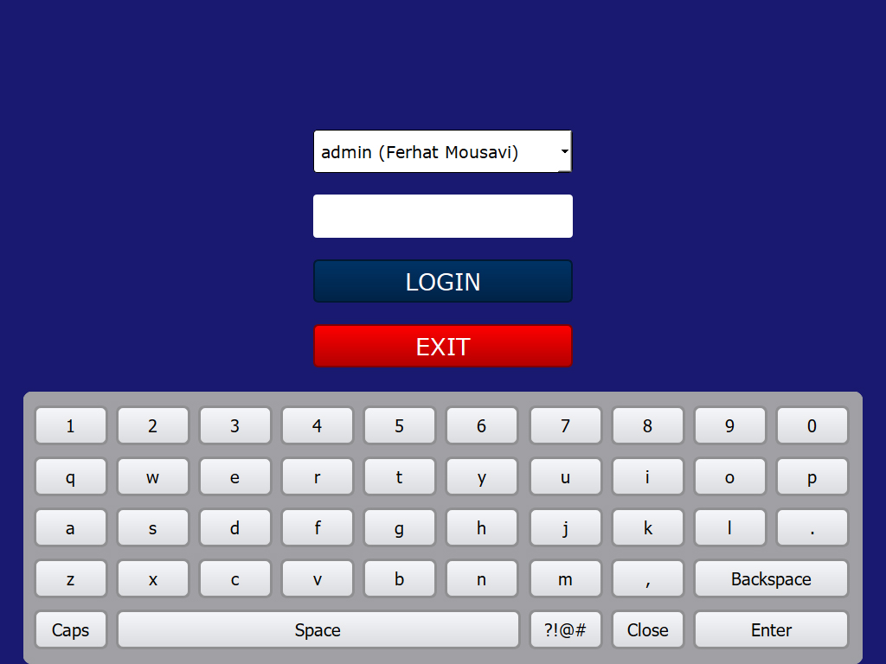
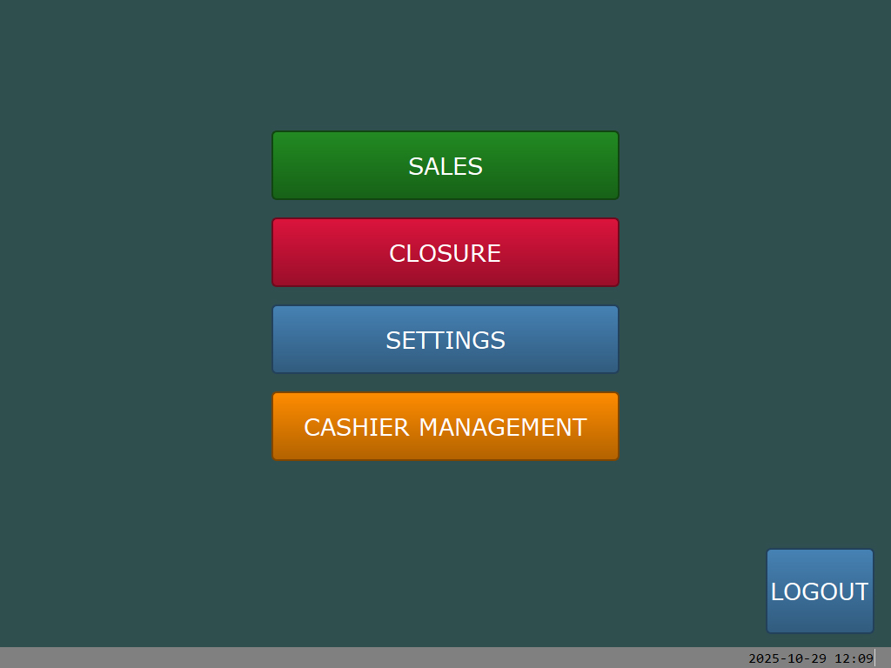
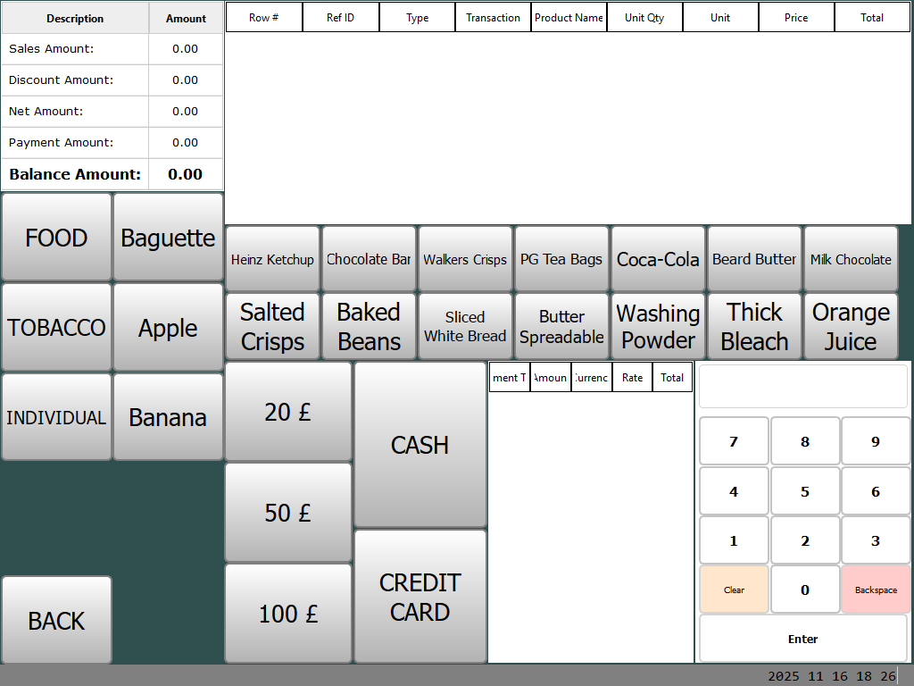

> **Under development. The project is not working properly yet.**
> **Current Version: 1.0.0b1 (Beta)**


# SaleFlex.PyPOS

### Touch Screen Point-of-Sale Application

SaleFlex.PyPOS is a modern, Python-based point-of-sale (POS) system designed for retail businesses, restaurants, and service-oriented establishments. Built with PySide6 (Qt framework), it offers a touch-optimized interface with cross-platform compatibility and robust database support.

## Key Features

SaleFlex.PyPOS POS system is designed to streamline the sales process and improve efficiency with these capabilities:

- **Multi-Payment Processing**: Accept cash, credit cards, debit cards, and mobile payments
- **Receipt & Invoice Generation**: Automated transaction documentation with ESC/P printer support
- **Inventory Management**: Real-time stock tracking with low-stock alerts
- **Customer Management**: Store customer information, preferences, and purchase history
- **Analytics & Reporting**: Comprehensive sales, inventory, and customer behavior analytics
- **System Integration**: Connect with accounting software, warehouse management, and ERP systems
- **️Returns & Exchanges**: Handle product returns and exchanges efficiently
- **Employee Management**: Track employee time, attendance, and performance
- **Campaign & Promotion Management**: Flexible promotional campaigns with time-based, product-specific, and basket discounts
- **Loyalty Programs**: Tiered membership rewards system with points earning, redemption, and customer segmentation
- **Optimized Performance**: In-memory caching of reference data minimizes disk I/O, extending disk life for POS devices with limited write cycles

## Project Structure

```
SaleFlex.PyPOS/
├── saleflex.py              # Main application entry point
├── requirements.txt         # Python dependencies
├── settings.toml           # Application configuration
├── db.sqlite3              # Default SQLite database
│
├── data_layer/             # Database & ORM Layer
│   ├── engine.py           # Database engine configuration
│   ├── model/              # Data models and CRUD operations
│   │   ├── crud_model.py   # Base CRUD operations
│   │   └── definition/     # Entity definitions
│   └── migrations/         # Database schema migrations
│
├── user_interface/         # UI Components
│   ├── window/             # Application windows and dialogs
│   ├── control/            # Custom UI controls
│   ├── render/             # Dynamic form rendering (database-driven)
│   └── manager/            # UI management logic
│
├── pos/                    # Core POS Business Logic
│   ├── manager/            # Application management
│   └── data/               # POS-specific data handling
│
├── settings/               # Configuration management
└── design_files/           # Design assets
```

## Business Applications

SaleFlex.PyPOS is designed to meet the diverse needs of various business types:

- **Retail Stores**: Complete retail management with inventory, customer tracking, and sales analytics
- **Fast Food Restaurants**: Quick service restaurant operations with order management
- **Chain Restaurants**: Multi-location restaurant management with centralized control
- **Service Businesses**: Various service-oriented establishments with customizable workflows

## SaleFlex.GATE Integration

SaleFlex.PyPOS integrates seamlessly with **[SaleFlex.GATE](https://github.com/SaleFlex/SaleFlex.GATE)** - a Django-based centralized management system:

- **Centralized Management**: Monitor and manage multiple POS systems from one dashboard
- **Cloud-Based Access**: Remote control and monitoring for business owners and managers
- **ERP Integration**: Seamless data synchronization with existing ERP systems
- **Scalable Architecture**: Support growing businesses with multiple locations
- **Secure Data Flow**: Robust API-based communication between POS terminals and backend

## System Requirements

### Hardware Requirements
- **Devices**: Linux/Windows supported touch screen devices
- **Displays**: Single or dual display configurations
- **Printers**: ESC/P compatible receipt printers
- **Scanners**: 2D and 3D barcode readers
- **Scales**: Weighing scales for retail environments

### Software Requirements
- **Python**: 3.13 or higher
- **PySide6**: 6.10.0 (Qt-based GUI framework)
- **SQLAlchemy**: 2.0.44 (ORM for database operations)
- **Requests**: 2.32.5 (HTTP client for API communications)

### Supported Database Engines
- **SQLite** (default, included)
- **PostgreSQL**
- **MySQL**
- **Oracle**
- **Microsoft SQL Server**
- **Firebird**
- **Sybase**

## Installation & Setup

### Prerequisites
1. Install [Python 3.13](https://www.python.org/downloads/) or higher
2. Ensure pip is installed and up to date

### Installation Steps

1. **Clone or Download** the SaleFlex.PyPOS project:
   ```bash
   git clone https://github.com/SaleFlex/SaleFlex.PyPOS.git
   cd SaleFlex.PyPOS
   ```

2. **Create Virtual Environment**:
   ```bash
   python3 -m venv venv
   ```

3. **Activate Virtual Environment**:
   
   **Windows:**
   ```cmd
   venv\Scripts\activate.bat
   ```
   
   **macOS/Linux:**
   ```bash
   source venv/bin/activate
   ```

4. **Install Dependencies**:
   ```bash
   pip install -r requirements.txt
   ```

5. **Run the Application**:
   ```bash
   python saleflex.py
   ```

### First Login

After running the application, you will see the login screen:



**Default Login Credentials:**
- **Username**: `admin`
- **Password**: `admin`

After successful login, you will be redirected to the main menu:



If you select "SALES", you will see a form as shown below:



### Configuration
- Edit `settings.toml` to configure database connections and basic application settings
- **Note**: Many POS settings (hardware ports, display settings, backend connections) are now managed through the database (`PosSettings` model) and can be configured via the application UI or API
- The application uses SQLite by default, stored in `db.sqlite3`
- Device information (serial number, OS) is automatically detected and stored on first initialization

## Development Roadmap

### Core Infrastructure
- [x] **Project Structure** - Basic application framework
- [x] **Database Layer** - SQLAlchemy ORM integration
- [x] **Database Structure** - POS data layer structure
- [x] **UI Foundation** - PySide6 interface framework
- [ ] **Configuration Management** - Advanced settings system
- [ ] **Logging & Monitoring** - Comprehensive logging and error tracking

### POS Core Modules
- [ ] **POS Manager Module** - Central business logic and transaction handling
- [ ] **SPU/PLU Management** - Product and pricing management
- [ ] **Customer Module** - Customer relationship management
- [ ] **Payment Module** - Multi-payment method processing
- [ ] **Printer Module** - Receipt and invoice printing
- [ ] **Inventory Management** - Real-time stock tracking and control
- [ ] **Tax & Discount Engine** - Advanced tax calculation and discount management

### Hardware Integration
- [ ] **Payment Device Integration**:
  - [ ] Card Reader Support (Chip & PIN, Contactless)
  - [ ] Mobile Payment Integration (Apple Pay, Google Pay)
  - [ ] Cash Drawer Control
  - [ ] PIN Pad Integration
- [ ] **Peripheral Device Support**:
  - [ ] Barcode Scanner Integration
  - [ ] Electronic Scale Integration
  - [ ] Receipt Printer Drivers
  - [ ] Display Pole Integration
- [ ] **Hardware Abstraction Layer** - Unified hardware communication interface

### User Interface
- [ ] **Dynamic Interface Interpreter** - Flexible UI rendering system
- [ ] **Interface Functions** - Core UI interaction handlers
- [ ] **Tables Layout Module** - Restaurant table management
- [ ] **Screen Designer App** - Custom interface design tool
- [ ] **Multi-Display Support** - Customer and cashier display management
- [ ] **Touch Optimization** - Enhanced touch screen experience

### Business Features
- [ ] **Campaign & Promotion Management**:
  - [ ] Multiple Campaign Types (Product Discount, Basket Discount, Time-Based, Buy X Get Y, Welcome Bonus)
  - [ ] Flexible Discount Rules (Percentage, Fixed Amount, Free Product)
  - [ ] Time-Based Restrictions (Date Range, Daily Hours, Days of Week)
  - [ ] Product/Category/Brand/Payment Type Filters
  - [ ] Usage Limits & Priority Rules
  - [ ] Customer Segment Targeting
  - [ ] Coupon Generation & Management (QR Code, Barcode Support)
  - [ ] Campaign Usage Tracking & Analytics
- [ ] **Loyalty Program Management**:
  - [ ] Points Earning & Redemption Rules
  - [ ] Point Expiry Management
  - [ ] Tiered Membership System (Bronze, Silver, Gold, Platinum)
  - [ ] Welcome & Birthday Bonus Points
  - [ ] Tier-Based Benefits (Points Multiplier, Automatic Discounts)
  - [ ] Complete Point Transaction History
  - [ ] Customer Segmentation (VIP, New, Frequent, High Value, Inactive, Birthday)
  - [ ] GDPR Compliant Consent Management
- [ ] **Reports Module** - Comprehensive business analytics
- [ ] **Employee Management** - Staff scheduling and performance tracking
- [ ] **Returns & Exchanges** - Product return and exchange handling
- [ ] **Multi-Store Support** - Chain store management capabilities

### Warehouse & Inventory Management
- [ ] **Advanced Inventory Control**:
  - [ ] Real-time Stock Tracking
  - [ ] Multi-Location Inventory Management
  - [ ] Stock Transfer Between Locations
  - [ ] Automatic Reorder Points & Alerts
- [ ] **Warehouse Operations**:
  - [ ] Goods Receiving & Put-away
  - [ ] Pick & Pack Operations
  - [ ] Cycle Counting & Physical Inventory
  - [ ] Batch & Serial Number Tracking
- [ ] **Supply Chain Management**:
  - [ ] Vendor Management & Purchase Orders
  - [ ] Supplier Performance Analytics
  - [ ] Automated Procurement Workflows
  - [ ] Cost Analysis & Optimization
- [ ] **Inventory Analytics**:
  - [ ] ABC Analysis (Fast/Slow Moving Items)
  - [ ] Demand Forecasting
  - [ ] Inventory Turnover Reports
  - [ ] Wastage & Shrinkage Tracking

### Sector-Specific Features
- [ ] **Restaurant Management**:
  - [ ] Recipe & Ingredient Management
  - [ ] Kitchen Display System (KDS)
  - [ ] Table Management & Reservations
  - [ ] Menu Engineering & Cost Analysis
  - [ ] Food Safety & Expiration Tracking
- [ ] **Retail Store Management**:
  - [ ] Category & Brand Management
  - [ ] Size & Color Variations
  - [ ] Seasonal Pricing & Promotions
  - [ ] Customer Shopping Behavior Analytics
  - [ ] Planogram & Shelf Management
- [ ] **Fashion & Boutique**:
  - [ ] Size Matrix & Style Variations
  - [ ] Fashion Season Management
  - [ ] Consignment & Vendor Management
  - [ ] Trend Analysis & Buying Recommendations
  - [ ] Alteration & Custom Order Tracking
- [ ] **Grocery & Supermarket**:
  - [ ] Fresh Produce Management
  - [ ] Deli & Bakery Operations
  - [ ] Bulk Item Management
  - [ ] Supplier & Private Label Management
  - [ ] Perishable Item Rotation (FIFO/LIFO)

### Integration & Connectivity
- [ ] **SaleFlex.GATE Integration**:
  - [ ] Data Synchronization Service
  - [ ] ERP Connection Layer
  - [ ] Multi-Store Management
  - [ ] Cloud-Based Remote Access
  - [ ] Real-time Analytics Dashboard
- [ ] **Third-Party Integrations**:
  - [ ] Accounting Software APIs
  - [ ] E-commerce Platform Sync
  - [ ] Warehouse Management Systems
  - [ ] External Payment Gateways
- [ ] **Offline/Online Mode** - Seamless switching between online and offline operations

### Security & Authentication
- [ ] **User Authentication System** - Multi-level user access control
- [ ] **Data Encryption** - Secure data storage and transmission
- [ ] **Audit Trail** - Comprehensive transaction logging
- [ ] **Role-Based Access Control** - Granular permission management
- [ ] **PCI DSS Compliance** - Payment industry security standards

### Performance & Scalability
- [x] **In-Memory Data Caching** - Reference data loaded once at startup to minimize disk I/O
- [ ] **Database Optimization** - Query optimization and indexing
- [ ] **External Caching Layer** - Redis/Memcached integration (optional)
- [ ] **Load Testing** - Performance testing under high load
- [x] **Memory Management** - Efficient resource utilization via pos_data cache
- [ ] **Concurrent Transaction Handling** - Multi-terminal support

### Data Management
- [ ] **Data Migration Tools** - Database upgrade and migration utilities
- [ ] **Backup & Recovery** - Automated backup and restore systems
- [ ] **Data Export/Import** - CSV, Excel, and API data exchange
- [ ] **Data Archiving** - Long-term data storage solutions

### Localization & Compliance
- [ ] **Multi-Language Support** - Internationalization (i18n)
- [ ] **Currency Support** - Multi-currency handling
- [ ] **Tax Compliance** - Country-specific tax regulations
- [ ] **Fiscal Printer Support** - Government-mandated receipt requirements
- [ ] **Local Regulations** - Region-specific compliance features

## Contributing

We welcome contributions to SaleFlex.PyPOS! Please read our contributing guidelines and feel free to submit issues, feature requests, or pull requests.

## License

This project is licensed under the MIT License. See the [LICENSE](LICENSE) file for details.

## Contributors

<table>
<tr>
    <td align="center">
        <a href="https://github.com/ferhat-mousavi">
            
            <br />
            <sub><b>Ferhat Mousavi</b></sub>
        </a>
    </td>
</tr>
</table>

## Support & Donations

If you find SaleFlex.PyPOS valuable and want to support its development, you can contribute through cryptocurrency donations:

- **USDT**: `0xa5a87a939bfcd492f056c26e4febe102ea599b5b`
- **BUSD**: `0xa5a87a939bfcd492f056c26e4febe102ea599b5b`
- **BTC**: `184FDZ1qV2KFzEaNqMefw8UssG8Z57FA6F`
- **ETH**: `0xa5a87a939bfcd492f056c26e4febe102ea599b5b`
- **SOL**: `Gt3bDczPcJvfBeg9TTBrBJGSHLJVkvnSSTov8W3QMpQf`

Your support helps us continue developing new features and maintaining this open-source project.

---

**For more information about the SaleFlex ecosystem, visit [SaleFlex.GATE](https://github.com/SaleFlex/SaleFlex.GATE) for centralized management capabilities.**


