# SaleFlex.PyPOS

> **Current Status:** Beta v1.0.0b7 - Active Development
> Core POS functionality operational. See [roadmap](#development-roadmap) for upcoming features.

[Watch Demo](https://youtu.be/HoA2p6M8fuM) | [Documentation](docs/README.md) | [Quick Start](#quick-start)


### Touch Screen Point-of-Sale Application

SaleFlex.PyPOS is a modern, Python-based point-of-sale (POS) system designed for retail businesses, restaurants, and service-oriented establishments. Built with PySide6 (Qt framework), it offers a touch-optimized interface with cross-platform compatibility and robust database support.

[Current Version Demo: 1.0.0b3](https://youtu.be/HoA2p6M8fuM)

## Key Features

SaleFlex.PyPOS POS system is designed to streamline the sales process and improve efficiency with these capabilities:

- **Multi-Payment Processing**: Accept cash, credit cards, debit cards, and mobile payments
- **Receipt & Invoice Generation**: Automated transaction documentation with ESC/P printer support
- **Inventory Management**: Real-time stock tracking with low-stock alerts
- **Customer Management**: Store customer information, preferences, and purchase history. Fully operational Customer List search, Customer Detail view/edit, new-customer creation (ADD button), **Activity History** (`CUSTOMER_ACTIVITY_GRID` → `TransactionHead`), and **Point movements** (`CUSTOMER_LOYALTY_POINTS_GRID` → `LoyaltyPointTransaction` audit, up to 500 rows). Grids refresh after SAVE when adding a new customer. Existing DBs pick up the loyalty tab via startup patch `ensure_customer_loyalty_points_grid`. **Phone numbers** are stored in display form on `Customer.phone_number` and normalized to digits-only **`phone_normalized`** for loyalty de-duplication, exact search, and uniqueness validation on SAVE. Walk-in Customer (`is_walkin = True`) placeholder automatically receives all unassigned sale transactions. The **SUB TOTAL** control on the SALE form is **dual-function**: press **FUNC** once so **all** dual buttons show their alternate captions (**SUB TOTAL** → **CUSTOMER**); tap **CUSTOMER** to open the Customer List in *sale-assignment context* (BACK assigns the chosen or newly added customer). Any dual-button use resets **every** dual control on the form to its primary caption
- **Analytics & Reporting**: Comprehensive sales, inventory, and customer behavior analytics
- **System Integration**: Connect with accounting software, warehouse management, and ERP systems
- **Returns & Exchanges**: Handle product returns and exchanges efficiently
- **Employee Management**: Track employee time, attendance, and performance
- **Cashier Management**: Role-based cashier account management with dynamic combobox selection. Admin users can view and edit all cashier accounts and create new cashier accounts directly from the Cashier Management form via the **ADD NEW CASHIER** button (admin-only, hidden for non-admin users). Non-admin cashiers can update only their own password. Field-level read-only protection enforced at the form layer (`is_administrator` flag). New cashier entry uses in-place form manipulation (no full redraw) for seamless UX
- **Item Discount / Markup Buttons**: Two **dual-function** buttons on the SALE form (**DISC %** / **MARK %** and **DISC AMT** / **MARK AMT**) apply a line discount or markup to the last sold item according to the **label currently shown**; **FUNC** switches **all** dual buttons to their alternate captions without running an action, and a tap never flips the label by itself. After **any** dual-function button on the form is used, **every** dual button returns to its primary label. A modal dialog opens with an editable amount field, embedded numeric keypad (touch entry uses these keys only—the on-screen QWERTY **virtual keyboard** is **not** shown), and **Enter** / **APPLY** to confirm. On apply, the original line is cancelled (strikethrough) and a new line is inserted with recalculated **unit price**, **total**, and **VAT**. Discounts persist `unit_discount`, `discount_rate`, and `discount_reason`; markups set `discount_reason` to a `Markup …` description and clear line discount fields. Percentage markup is 1–100 %; amount markup is from the smallest currency step up to the line’s current total. Currency `decimal_places` from the `Currency` table controls minimum step and precision. See [Sale Transactions](docs/10-sale-transactions.md#applying-item-discounts-and-markups)
- **Campaign & Promotion Management**: Flexible promotional campaigns with time-based, product-specific, and basket discounts
- **Loyalty Programs**: Local tiered program (`LoyaltyProgram`, `LoyaltyTier`, seed data). **Policy** tables (`LoyaltyProgramPolicy`, `LoyaltyEarnRule`, `LoyaltyRedemptionPolicy`) configure phone-first identity, earn/redeem rules, and integration mode (`LOCAL` active; `GATE` / `EXTERNAL` reserved). Assigning a non–walk-in customer to a sale runs **`LoyaltyService`**: creates **`CustomerLoyalty`** when needed, sets **`TransactionHeadTemp.loyalty_member_id`**, grants **welcome** points into **`LoyaltyPointTransaction`**, and **re-evaluates membership tier**. **Redemption**: on **PAYMENT**, enter whole points on the numpad then **BONUS** (`BONUS_PAYMENT`) — **`LoyaltyRedemptionService`** applies a **`LOYALTY`** **`TransactionDiscountTemp`** using `currency_per_point` and redemption policy caps; balances use **net** due (gross − discounts). Each **completed sale** (`PaymentService.copy_temp_to_permanent`) runs **`LoyaltyEarnService`** (optional **`earn_eligible_payment_types`** in `settings_json`), copies discounts, then **`LoyaltyService`** posts **`REDEEMED`** / **`EARNED`** ledger rows and **refreshes `fk_loyalty_tier_id`**. **Reporting / audit**: **Customer Detail → Point movements** (`CUSTOMER_LOYALTY_POINTS_GRID`); **Closure → receipt detail** shows **Loyalty — points earned/redeemed** on `TransactionHead`. See [docs/41-loyalty-programs.md](docs/41-loyalty-programs.md)
- **Country-Specific Closure Templates**: Flexible template system for country-specific closure data (E-Fatura for Turkey, state tax for USA, VAT reporting for EU, etc.) stored as JSON templates in `static_files/closures/` directory
- **Region Support**: `CountryRegion` model tracks sub-country regions (states, provinces, special economic zones) with ISO 3166-2 compliant fields. Includes 80+ pre-populated regions for region-specific closure templates and compliance
- **Active Closure Management**: Session-based closure tracking system that automatically loads open closures at startup and manages closure lifecycle (open → active → closed). Closure data is maintained in memory during operations and saved to database when closed. On end-of-day closure, `ClosureNumber` is incremented by 1 and `ReceiptNumber` is reset to 1 — every closure period's receipts restart from 1 independently. After closure completes a **green info dialog** ("End-of-Day Closure Complete") confirms the closed closure number; on any failure a **red error dialog** explains the reason (not logged in, insufficient permissions, no transactions found, configuration error, etc.). **Closure history navigation:** The CLOSURE form includes **DETAIL** and **RECEIPTS** buttons at the bottom-left that open dedicated sub-forms — `CLOSURE_DETAIL` (key/value summary), `CLOSURE_RECEIPTS` (receipt list), and `CLOSURE_RECEIPT_DETAIL` (receipt line items) — all DB-driven dynamic forms with BACK navigation.
- **Document Management System**: Complete transaction lifecycle management with temporary models during processing and automatic conversion to permanent models upon completion. Automatically updates document data during sales operations (PLU and department sales). Supports per-line REPEAT (clone line, save new DB record, update totals) and DELETE (soft-cancel line, mark `is_cancel=True` in DB, recalculate totals) actions from the sale list item popup; if the last active line is deleted the document is automatically cancelled and reset. **CANCEL button:** Red **CANCEL** button on the SALE form (below the denomination buttons, same row as PLU/X/SUSPEND) immediately voids the entire active transaction — sets `transaction_status=CANCELLED`, `is_cancel=True`, `cancel_reason="Canceled by cashier: {username}"`, copies to permanent models, shows a confirmation dialog with receipt/closure number and total, then opens a new draft. If no open document exists, an info dialog is shown instead. **Market suspend:** **SUSPEND** saves the cart as pending, then creates a **new draft** (suspended rows no longer steal the receipt slot in `create_empty_document`). **SUSPENDED_SALES_MARKET** lists suspended receipts (hidden head id + columns); **ACTIVATE** (`RESUME_SALE`) clears `is_pending`, loads lines on **SALE**, and abandons any empty draft left open first. **Closure:** `TransactionHead` rows with `is_pending=True` and open `TransactionHeadTemp` suspended carts for the closure period are **excluded** from aggregated sales totals; their count is stored on `Closure.suspended_transaction_count`. Automatic recovery of incomplete **non-pending** transactions at startup; restores sale UI when re-entering **SALE** with an ACTIVE document. **Transaction Unique ID:** Each document is identified by `"{YYYYMMDD}-{closure_number:04d}-{receipt_number:06d}"` (e.g. `"20250406-0002-000001"`), scoping receipt numbers per closure period so that the post-closure reset to receipt 1 never conflicts with earlier receipts from the same calendar day
- **Auto-Save Functionality**: Automatic database persistence system using descriptor pattern and wrapper classes. Model instances and dictionaries are automatically saved to the database when attributes are modified, ensuring data integrity and reducing manual save operations. Supports nested model wrapping and skip flags for batch operations
- **Peripherals (OPOS-style)**: `pos/peripherals/` defines cash drawer, receipt printer, line display, scanner, scale, customer display, and remote order display classes. Wired behaviours (log-only until drivers exist): completed sale → formatted receipt printed line-by-line + drawer open; end-of-day closure → Z-report printed line-by-line; CASH with no document → drawer open; selling and payment steps → three-line customer display updates. **Sale receipt** (38-char thermal): product lines, item count + balance due, payment methods, change, VAT. **Closure Z-report** (42-char thermal): closure metadata, net/gross sales, cash balance, VAT breakdown table, payment method totals, document type counts, transaction summary. Each line sent individually as `[POSPrinter] | <line>` to the log. See [docs/30-peripherals.md](docs/30-peripherals.md)
- **Startup Guards**: `saleflex.py` entry point runs four pre-flight checks before any module is imported: (1) working-directory normalisation so relative paths always resolve correctly; (2) Python >= 3.13 version guard with a clear error message; (3) file-based single-instance lock (`msvcrt.locking` on Windows, `fcntl.flock` on Linux/macOS) that is automatically released on process exit; (4) global exception handler that logs unhandled errors at `CRITICAL` level before terminating. See [docs/34-startup-entry-point.md](docs/34-startup-entry-point.md)
- **Central Logging**: Configurable logging via `core/logger.py` with a single `saleflex` root logger. Log level (DEBUG/INFO/WARNING/ERROR/CRITICAL), console output, and file output are controlled from the `[logging]` section in `settings.toml`. All modules use `get_logger(__name__)` for consistent, hierarchical log records
- **Centralized Exception Handling**: Typed exception hierarchy rooted at `SaleFlexError` (`core/exceptions.py`). Domain-specific subclasses (`PaymentError`, `FiscalDeviceError`, `GATEConnectionError`, `TaxCalculationError`, `DatabaseError`, etc.) replace bare `Exception` raises throughout the codebase. All exceptions are chained with `raise ... from e` to preserve the full traceback
- **Product Management**: Dedicated **Product List** form (form_no=8) accessible from the Main Menu. Supports real-time search by product name or short name with instant DataGrid results. Selecting a row and pressing **DETAIL** opens the **Product Detail** modal dialog (form_no=9, fully DB-driven via `DynamicDialog`) — a tabbed view built with the new `TabControl` widget and `FormControlTab` model, showing Product Info, Barcodes, Attributes, and Variants in four separate read-only tabs. See [docs/15-product-management.md](docs/15-product-management.md)
- **Optimized Performance**: In-memory caching of reference data (`pos_data`) and product data (`product_data`) minimizes disk I/O, extending disk life for POS devices with limited write cycles. All product lookups, currency calculations, VAT rate lookups, button rendering, and sale operations use cached data instead of database queries
- **Smart NumPad (4 Modes)**: The SALE form NumPad supports four operating modes: (1) **Barcode/PLU lookup** — type a barcode or product code and press ENTER to find and sell the product (searches `ProductBarcode` then `Product.code`); (2) **Inline quantity** — type a quantity then press a PLU product button to sell that many units; (3) **X (Quantity Multiplier) button** — pre-set the quantity before a barcode scan; status bar shows the active multiplier (`x1`, `x3`, etc.); (4) **Payment amount** — enter the tendered amount in minor currency units (e.g. 10000 → £100.00) then press CASH or CREDIT CARD. **PLU inquiry** (separate green **PLU** button beside **X**) shows price and per-warehouse stock from cached `WarehouseProductStock` without selling — either enter the code then **PLU**, or press **PLU** first then enter the code and **ENTER**

## Architecture Overview

SaleFlex.PyPOS follows a layered architecture pattern with clear separation of concerns:

- **Entry Point** (`saleflex.py`): Pre-flight startup guards — working-directory normalisation, Python version check, single-instance lock, and global exception handler
- **Application Layer** (`pos/manager/application.py`): Main application class implementing Singleton pattern, combining CurrentStatus, CurrentData, and EventHandler
- **Business Logic Layer** (`pos/service/`): Service classes (VatService, SaleService, PaymentService, LoyaltyEarnService, LoyaltyRedemptionService, LoyaltyService, CustomerSegmentService) for centralized business operations
- **Peripherals Layer** (`pos/peripherals/`): OPOS-style device abstractions (cash drawer, receipt printer, line display, scanner, scale, customer display, remote order display). Current implementation is **log-only** (no device probing); see [docs/30-peripherals.md](docs/30-peripherals.md)
- **Event Handling Layer** (`pos/manager/event/`): 10 specialized event handler classes for modular event processing (General, Sale, Payment, Closure, Config, Service, Report, Hardware, Warehouse, **Product**). Event handler methods use `_event` suffix naming convention (e.g., `_sales_form_event`, `_closure_event`, `_product_detail_event`) to distinguish them from properties
- **Integration Layer** (`pos/integration/`): External system connectivity with two tiers — **SaleFlex.GATE** (primary hub for transactions, closures, warehouse, campaigns, notifications) and **third-party direct connectors** (ERP, payment gateways, campaign modules). Uses offline outbox pattern (`SyncQueueItem`) and a background `SyncWorker` (QThread). All connectors are log-only stubs until configured; see [docs/40-integration-layer.md](docs/40-integration-layer.md)
- **Data Access Layer** (`data_layer/model/`): 100+ SQLAlchemy models with CRUD operations and auto-save functionality
- **UI Layer** (`user_interface/`): PySide6-based UI components with dynamic form rendering
- **Caching Layer** (`pos/manager/cache_manager.py`): In-memory caching for reference and product data
- **Logging Layer** (`core/logger.py`): Central logging module; all components use `get_logger(__name__)` with configuration from `settings.toml` `[logging]`
- **Exception Layer** (`core/exceptions.py`): Typed exception hierarchy (`SaleFlexError` root) with domain subclasses for payment, hardware, tax, database, document, configuration, authentication, GATE connectivity, and third-party integration errors

```
┌─────────────────────────────────────────────────┐
│            UI Layer (PySide6)                   │
│  Dynamic Forms · Virtual Keyboard · Controls    │
├─────────────────────────────────────────────────┤
│      Event Handlers (10 specialized modules)    │
│  General · Sale · Payment · Closure · Config    │
│  Service · Report · Hardware · Warehouse        │
│  Product                                        │
├─────────────────────────────────────────────────┤
│          Business Logic (Service Layer)         │
│ VatService · SaleService · PaymentService       │
│ LoyaltyEarnService · LoyaltyRedemptionService   │
│ LoyaltyService · CustomerSegmentService         │
├─────────────────────────────────────────────────┤
│         OPOS Peripherals (log-only stubs)       │
│   CashDrawer · POSPrinter · LineDisplay         │
├─────────────────────────────────────────────────┤
│    Integration Layer (pos/integration/)         │
│  GateSyncService · GatePullService · SyncWorker │
│  BaseERPConnector · BasePaymentGateway          │
│  BaseCampaignConnector · IntegrationMixin       │
├─────────────────────────────────────────────────┤
│          Data Access Layer (ORM)                │
│     100+ SQLAlchemy Models · CRUD               │
│     SyncQueueItem · GateNotification            │
├─────────────────────────────────────────────────┤
│       Cache Layer (pos_data / product_data)     │
├─────────────────────────────────────────────────┤
│            Database (SQLite / PostgreSQL)       │
└─────────────────────────────────────────────────┘
         ↕ core/logger.py (all layers)
         ↕ core/exceptions.py (all layers)
         ↕ SaleFlex.GATE / ERP / Payment / Campaign
```

## Project Structure

```
SaleFlex.PyPOS/
├── saleflex.py              # Main application entry point (startup guards, version check, single-instance lock)
├── requirements.txt         # Python dependencies
├── settings.toml           # Application configuration
├── db.sqlite3              # Default SQLite database
├── .saleflex.lock          # Runtime single-instance process lock (auto-created/deleted; not committed)
├── PyPOS_GUIDE.md          # Quick reference guide (redirects to docs/)
│
├── docs/                   # Comprehensive documentation
│   ├── README.md           # Documentation index
│   └── *.md                # Topic-specific documentation files
│
├── data_layer/             # Database & ORM Layer
│   ├── engine.py           # Database engine configuration
│   ├── db_initializer.py   # Database initialization
│   ├── db_manager.py       # Database management utilities
│   ├── db_utils.py         # Database helper functions
│   │
│   ├── auto_save/          # Auto-save functionality
│   │   ├── auto_save_model.py
│   │   ├── auto_save_dict.py
│   │   └── auto_save_descriptor.py
│   │
│   ├── db_init_data/       # Initial data seeding (one module per domain)
│   │   ├── cashier.py
│   │   ├── country.py
│   │   ├── currency.py
│   │   ├── product.py
│   │   ├── form.py         # Orchestrator — delegates to forms/
│   │   ├── form_control.py # Orchestrator — delegates to forms/
│   │   ├── forms/          # Form + control definitions split by topic
│   │   │   ├── login.py      # Form #1: LOGIN
│   │   │   ├── main_menu.py  # Form #2: MAIN_MENU
│   │   │   ├── management.py # Form rows #3 SETTING, #4 CASHIER
│   │   │   ├── setting_form.py # #3 SETTING controls: TABCONTROL (POS + loyalty tabs)
│   │   │   ├── sale.py       # Forms #5 SALE, #7 SUSPENDED_SALES_MARKET
│   │   │   ├── closure.py    # Forms #6, #10, #11, #12 (closure group)
│   │   │   ├── product.py    # Forms #8 PRODUCT_LIST, #9 PRODUCT_DETAIL
│   │   │   ├── stock.py      # Forms #13–#16 (inventory group)
│   │   │   └── customer.py   # Forms #17–#19 (customer group)
│   │   └── ...             # Other initialization modules
│   │
│   ├── enums/              # Enumeration definitions
│   │   ├── control_name.py
│   │   ├── control_type.py
│   │   ├── custom_control_type_name.py
│   │   ├── event_name.py
│   │   └── form_name.py
│   │
│   └── model/              # Data models and CRUD operations
│       ├── crud_model.py   # Base CRUD operations
│       ├── mixins.py       # Model mixins
│       └── definition/     # Entity definitions (100+ models)
│
├── user_interface/         # UI Components
│   ├── window/             # Application windows and dialogs
│   │   ├── base_window.py
│   │   └── dynamic_dialog.py
│   │
│   ├── control/            # Custom UI controls
│   │   ├── button.py
│   │   ├── textbox.py
│   │   ├── checkbox.py
│   │   ├── combobox.py
│   │   ├── label.py
│   │   ├── datagrid.py
│   │   ├── panel.py        # Panel control with scrollbar support
│   │   ├── toolbar.py
│   │   ├── statusbar.py
│   │   ├── amount_table/   # Amount table control
│   │   ├── numpad/         # Numeric pad control
│   │   ├── payment_list/   # Payment list control
│   │   ├── sale_list/      # Sale list control
│   │   ├── tab_control/    # Tab control (QTabWidget, DB-driven pages via FormControlTab)
│   │   ├── transaction_status/  # Transaction status display
│   │   └── virtual_keyboard/    # Virtual keyboard component
│   │
│   ├── form/               # Form definitions
│   │   ├── about_form.py
│   │   └── message_form.py
│   │
│   ├── render/             # Dynamic form rendering (database-driven)
│   │   └── dynamic_renderer.py
│   │
│   └── manager/            # UI management logic
│       └── interface.py
│
├── pos/                    # Core POS Business Logic
│   ├── data/               # POS-specific data types
│   │   ├── document_type.py
│   │   ├── document_state.py
│   │   ├── payment_type.py
│   │   └── discount_type.py
│   │
│   ├── hardware/           # Hardware integration
│   │   └── device_info.py  # Device information detection
│   │
│   ├── peripherals/        # OPOS-style peripherals (log-only until drivers are added)
│   │   ├── cash_drawer.py
│   │   ├── pos_printer.py
│   │   ├── line_display.py
│   │   ├── hooks.py        # SALE form line-display sync helpers
│   │   └── ...             # scanner, scale, customer_display, remote_order_display stubs
│   │
│   ├── integration/        # External system connectivity
│   │   ├── external_device.py      # Base stub (mirrors OposDevice)
│   │   ├── hooks.py                # Event-to-integration glue
│   │   ├── gate/                   # SaleFlex.GATE — primary hub
│   │   │   ├── gate_client.py      # HTTP client
│   │   │   ├── gate_auth.py        # JWT / API token management
│   │   │   ├── gate_sync_service.py# Outbound push (transactions, closures, warehouse)
│   │   │   ├── gate_pull_service.py# Inbound pull (products, campaigns, notifications)
│   │   │   └── serializers/        # GATE API payload converters
│   │   └── third_party/            # Direct third-party connectors
│   │       ├── base_erp_connector.py
│   │       ├── base_payment_gateway.py
│   │       ├── base_campaign_connector.py
│   │       └── adapters/           # Concrete adapter implementations
│   │           ├── erp/
│   │           ├── payment/
│   │           └── campaign/
│   │
│   ├── service/            # Business logic services
│   │   ├── vat_service.py     # VAT calculation service
│   │   ├── sale_service.py      # Sale processing service
│   │   ├── payment_service.py   # Payment processing service
│   │   ├── loyalty_service.py           # Phone normalization, enrollment, tier & spending; credits EARNED after sale
│   │   ├── loyalty_earn_service.py     # Document/line/rule point calculation; stages temp head + TransactionLoyaltyTemp
│   │   ├── loyalty_redemption_service.py  # BONUS: points → LOYALTY discount; policy caps
│   │   └── customer_segment_service.py   # Auto segment membership from criteria_json; marketing_profile
│   │
│   └── manager/            # Application management
│       ├── application.py        # Main application class
│       ├── current_data.py       # Current session data
│       ├── current_status.py
│       ├── cache_manager.py      # Data caching
│       ├── closure_manager.py    # Closure management
│       ├── document_manager.py   # Document lifecycle
│       ├── integration_mixin.py  # Integration routing mixin
│       ├── sync_worker.py        # QThread background sync worker
│       ├── event_handler.py      # Event handling (combines all event handlers)
│       └── event/                # Event handlers (10 specialized event handler classes)
│           ├── general.py        # GeneralEvent: Login, logout, exit, navigation
│           ├── sale.py           # SaleEvent: Sales transaction and product events
│           ├── payment.py        # PaymentEvent: Payment processing events
│           ├── closure.py        # ClosureEvent: End-of-day closure operations
│           ├── configuration.py  # ConfigurationEvent: Settings and configuration
│           ├── service.py        # ServiceEvent: Service-related operations
│           ├── report.py         # ReportEvent: Report generation and viewing
│           ├── hardware.py       # HardwareEvent: Hardware device operations
│           ├── warehouse.py      # WarehouseEvent: Warehouse and inventory operations
│           └── product.py        # ProductEvent: Product list, search, and detail events
│
├── core/                    # Core utilities
│   ├── logger.py           # Central logging (get_logger, config via settings.toml [logging])
│   └── exceptions.py       # Centralized exception hierarchy (SaleFlexError root)
│
├── settings/               # Configuration management
│   └── settings.py
│
├── static_files/           # Static assets
│   ├── closures/           # Country-specific closure templates
│   │   ├── tr.json
│   │   ├── usa.json
│   │   ├── usa_ca.json
│   │   └── ...
│   └── images/             # Image assets
│       ├── saleflex.ico
│       └── ...
```

## Business Applications

SaleFlex.PyPOS is designed to meet the diverse needs of various business types:

- **Retail Stores**: Complete retail management with inventory, customer tracking, and sales analytics
- **Fast Food Restaurants**: Quick service restaurant operations with order management
- **Chain Restaurants**: Multi-location restaurant management with centralized control
- **Service Businesses**: Various service-oriented establishments with customizable workflows

## SaleFlex.GATE Integration

SaleFlex.PyPOS integrates seamlessly with **[SaleFlex.GATE](https://github.com/SaleFlex/SaleFlex.GATE)** - a Django-based centralized management system:

- **Centralized Management**: Monitor and manage multiple POS systems from one dashboard
- **Cloud-Based Access**: Remote control and monitoring for business owners and managers
- **ERP Integration**: Seamless data synchronization with existing ERP systems
- **Scalable Architecture**: Support growing businesses with multiple locations
- **Secure Data Flow**: Robust API-based communication between POS terminals and backend

## System Requirements

### Hardware Requirements
- **Devices**: Linux/Windows supported touch screen devices
- **Displays**: Single or dual display configurations
- **Printers**: ESC/P compatible receipt printers
- **Scanners**: 2D and 3D barcode readers
- **Scales**: Weighing scales for retail environments

### Software Requirements
- **Python**: 3.13 or higher (recommended)
- **PySide6**: 6.11.0 (Qt-based GUI framework)
- **SQLAlchemy**: 2.0.48 (ORM for database operations)
- **Requests**: 2.33.0 (HTTP client for API communications)

> **Note on Python 3.14:** Python 3.14 can be used to run the application, but SQLAlchemy does not yet officially support Python 3.14. You may encounter unexpected issues or incompatibilities. It is recommended to use Python 3.13 until official SQLAlchemy support for Python 3.14 is confirmed.

### Supported Database Engines
- **SQLite** (default, included)
- **PostgreSQL**
- **MySQL**
- **Oracle**
- **Microsoft SQL Server**
- **Firebird**
- **Sybase**

## Quick Start
```bash
git clone https://github.com/SaleFlex/SaleFlex.PyPOS.git
cd SaleFlex.PyPOS
python3 -m venv venv
source venv/bin/activate  # Windows: venv\Scripts\activate.bat
pip install -r requirements.txt
python saleflex.py
```

**Default credentials:** `admin` / `admin` (administrator) · `jdoe` / `1234` (standard cashier)

## Installation & Setup

### Prerequisites
1. Install [Python 3.13](https://www.python.org/downloads/) or higher (**Python 3.14 is not yet officially supported by SQLAlchemy — use 3.13 for best compatibility**)
2. Ensure pip is installed and up to date

### Installation Steps

1. **Clone or Download** the SaleFlex.PyPOS project:
   ```bash
   git clone https://github.com/SaleFlex/SaleFlex.PyPOS.git
   cd SaleFlex.PyPOS
   ```

2. **Create Virtual Environment**:
   ```bash
   python3 -m venv venv
   ```

3. **Activate Virtual Environment**:
   
   **Windows:**
   ```cmd
   venv\Scripts\activate.bat
   ```
   
   **macOS/Linux:**
   ```bash
   source venv/bin/activate
   ```

4. **Install Dependencies**:
   ```bash
   pip install -r requirements.txt
   ```

5. **Run the Application**:
   ```bash
   python saleflex.py
   ```

### First Login

After running the application, you will see the login screen:

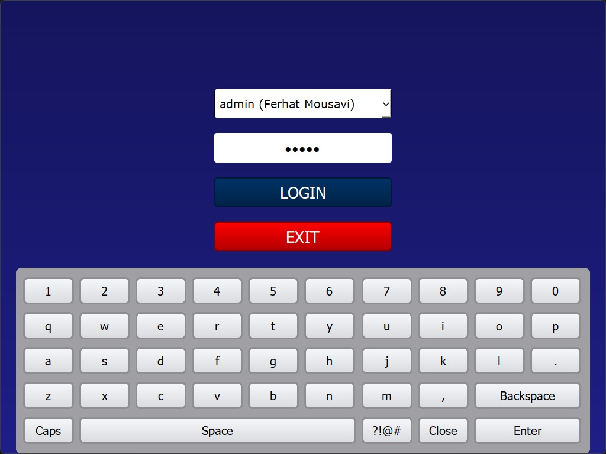

> Touch-optimised login screen with cashier selection combobox, password field, and on-screen virtual keyboard.

**Default Login Credentials:**

| Username | Password | Role |
|---|---|---|
| `admin` | `admin` | Administrator — can edit all cashier accounts |
| `jdoe` | `1234` | Standard cashier — can update own password only |

After successful login, you will be redirected to the main menu:

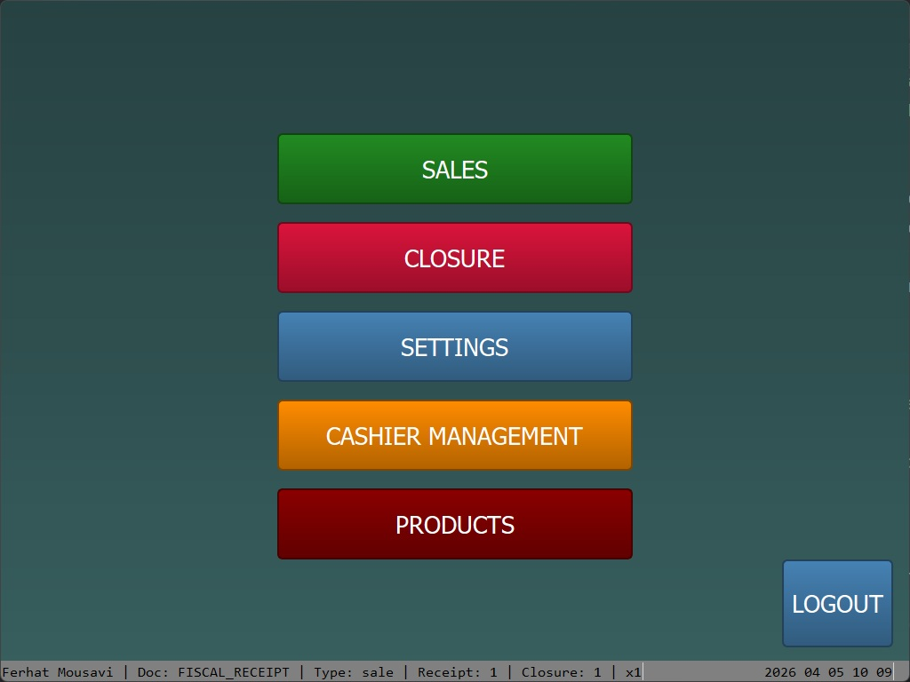

> Main Menu listing all major modules: Sales, Closure, Settings, Cashier Management, Products, Warehouse, Customer, and Logout.

If you select "SALES", you will see a form as shown below:

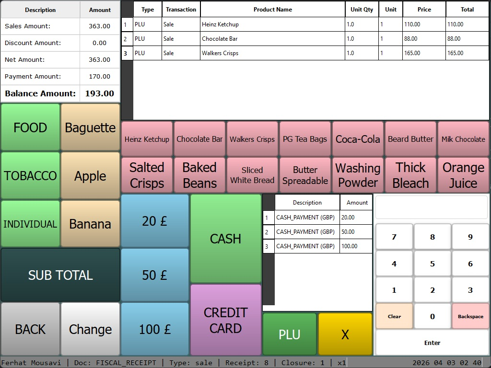

> SALE form with PLU product buttons, department buttons, sale list, payment methods (Cash/Credit Card), NumPad, and real-time transaction totals.

Press **FUNC** once to switch **all** dual-function controls to their alternate captions (for example **SUB TOTAL** → **CUSTOMER**, **CREDIT CARD** → **PAYMENT**, **DISC %** / **DISC AMT** → **MARK %** / **MARK AMT**, **SUSPEND** → **CANCEL**). **FUNC** only changes labels; it does not run a sale action.

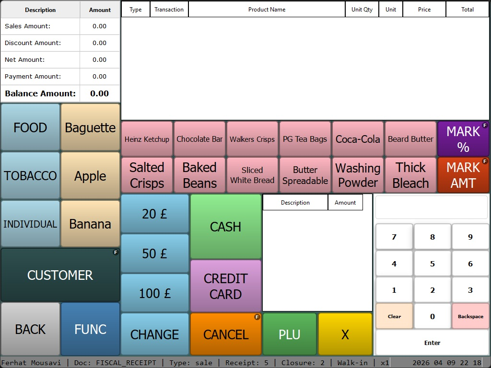

> Same SALE layout with alternate dual-function labels visible after **FUNC** (including **CUSTOMER** for assigning a customer to the active sale).

With alternate labels active, tap **CUSTOMER** to open the Customer List in *sale-assignment context* (BACK links the chosen or newly added customer to the open document).

Tap **PAYMENT** (alternate label on **CREDIT CARD**) to open the dedicated **PAYMENT** form: **AMOUNTSTABLE**, **PAYMENTLIST**, **NUMPAD**, **BACK**, and buttons for all standard payment categories (cash, card, cheque, on credit, prepaid, mobile, bonus, exchange, current account, bank transfer). **AMOUNTSTABLE** stretches its summary rows to fill the control height (same font). **BACK** returns to the SALE form; completing the sale from this screen returns to SALE with a new empty document. See [Sale Transactions — PAYMENT form](docs/10-sale-transactions.md#payment-form).

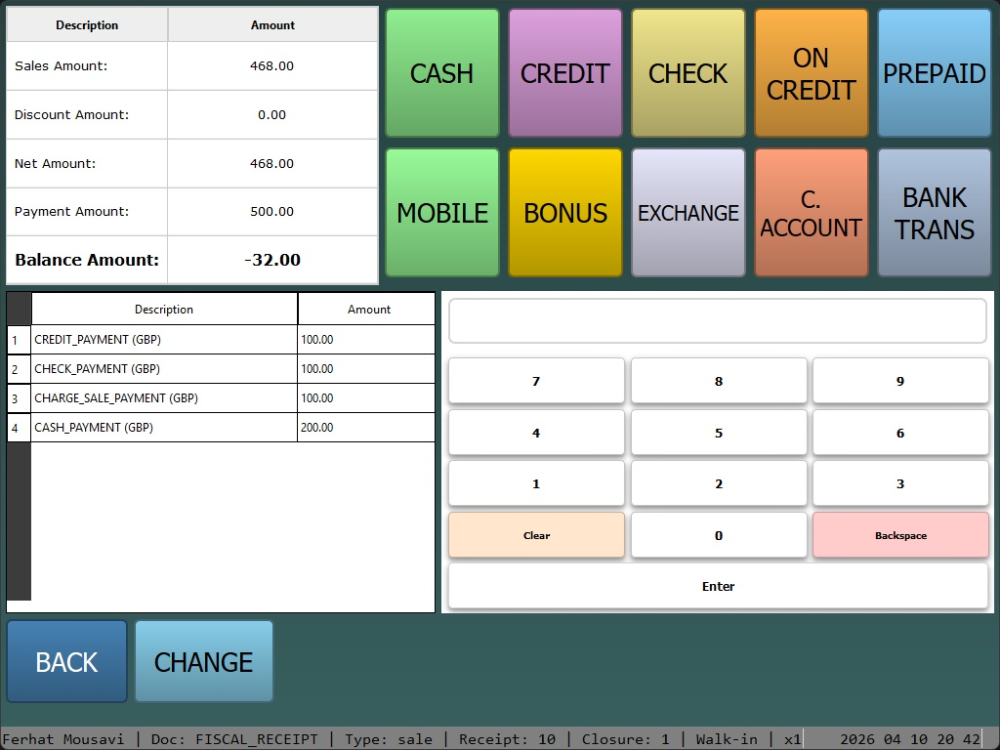

> **PAYMENT** screen: live totals (**AMOUNTSTABLE** stretches summary rows to the control height; font size unchanged), payment-type grid, tender log (**PAYMENTLIST**), **NUMPAD** for amounts in minor units, **BACK**, and **CHANGE**. Use split tenders until the balance reaches zero; each payment type expects a NumPad amount first (unlike quick pay on the main SALE layout).

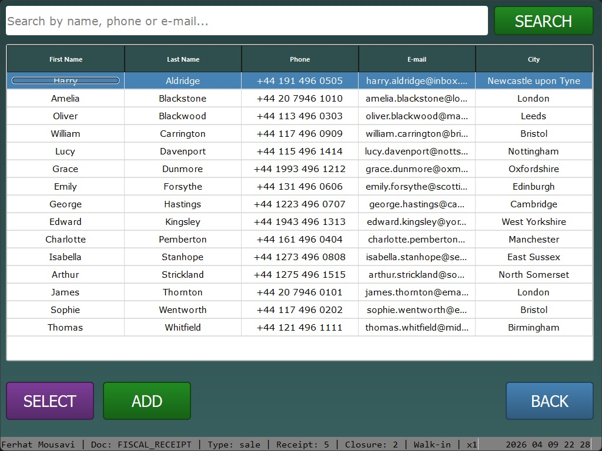

> SALE form illustrating the **CUSTOMER** path from the dual-function row (after **FUNC**), next to **BACK** and **FUNC**.

Selecting "CLOSURE" opens the end-of-day closure screen:

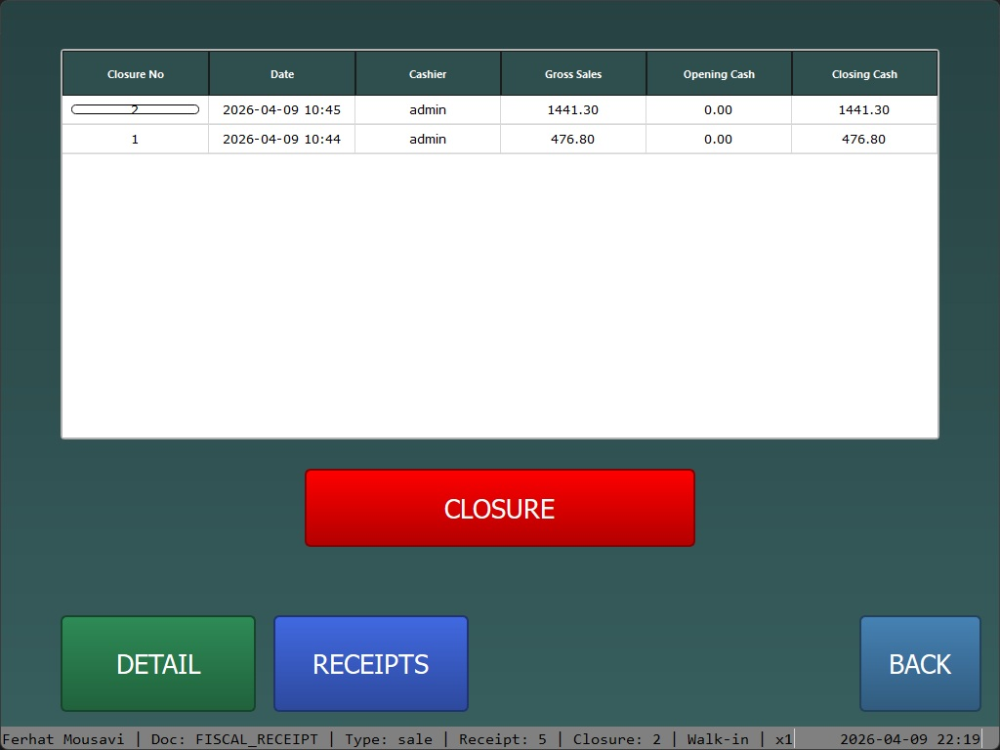

> Closure form listing all completed closures with gross sales, opening cash, and closing cash totals. Administrators can perform end-of-day closure from this screen.  
> Two additional buttons at the bottom-left allow browsing historical data:
>
> - **DETAIL** — Opens the `CLOSURE_DETAIL` form showing a key/value summary of the selected closure (dates, cashier, document counts, gross/net sales, tax, discount, tip, cash amounts).  
> - **RECEIPTS** — Opens the `CLOSURE_RECEIPTS` form listing every receipt (TransactionHead) that belongs to the selected closure. From this form a receipt can be selected and its **DETAIL** button opens the `CLOSURE_RECEIPT_DETAIL` form with full header fields and line items.  
> All three sub-forms are DB-driven dynamic forms with a **BACK** button in the bottom-right corner to return to the previous screen.

Clicking **DETAIL** on a selected closure opens the closure detail summary:

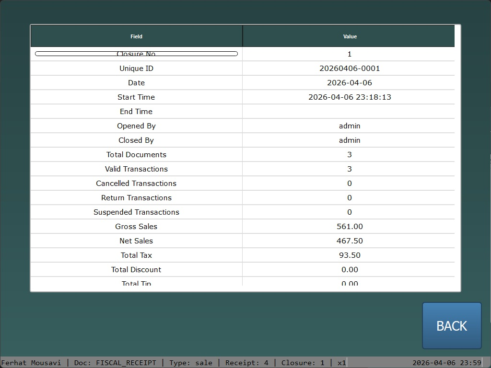

> Closure Detail form showing a key/value summary of the selected closure period: closure number, unique ID, date, start/end times, opened/closed by cashier, document counts, gross/net sales, total tax, discount, and tip amounts.

Clicking **RECEIPTS** on a selected closure lists all receipts for that period:

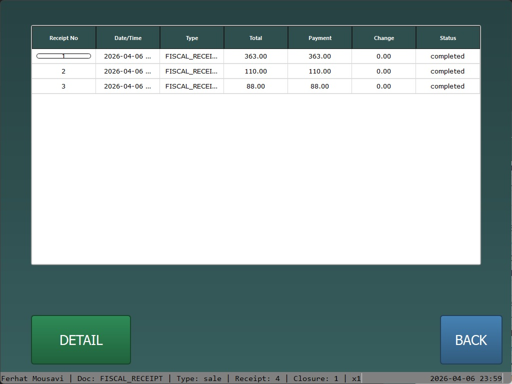

> Closure Receipts form listing every receipt (TransactionHead) belonging to the selected closure, with columns for Receipt No, Date/Time, Type, Total, Payment, Change, and Status. Select a receipt and press **DETAIL** to drill into its line items.

Clicking **DETAIL** on a selected receipt opens the full receipt breakdown:

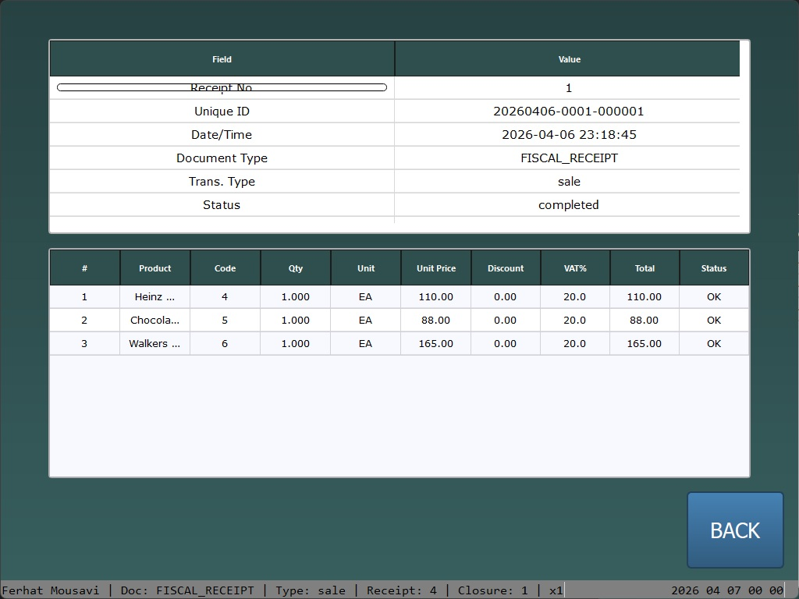

> Closure Receipt Details form displaying the receipt header (receipt number, unique ID, date/time, document type, transaction type, status) alongside a line-item table showing product name, code, quantity, unit, unit price, discount, VAT%, total, and line status.

Selecting **SETTINGS** opens the **SETTING** form: a **TABCONTROL** with **POS** (hardware, backend, store identity → `PosSettings`) and separate tabs for **Loyalty program**, **Loyalty policy**, and **Loyalty redemption** (`LoyaltyProgram`, `LoyaltyProgramPolicy`, `LoyaltyRedemptionPolicy`). One **SAVE** persists all edited panels. Older databases are upgraded to this layout on startup via `ensure_setting_form_tabs` (see [Configuration](docs/04-configuration.md)).

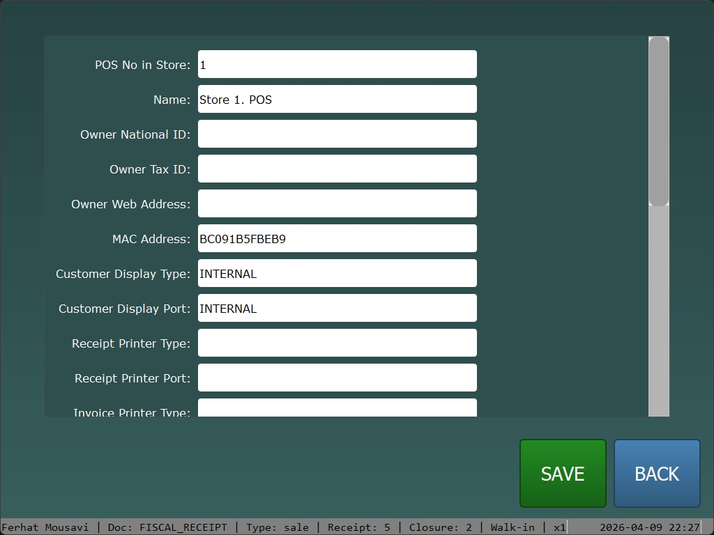

> Sample screenshot may show the POS tab only; loyalty fields live on the additional tabs described above.

Selecting "CASHIER MANAGEMENT" allows managing cashier accounts:

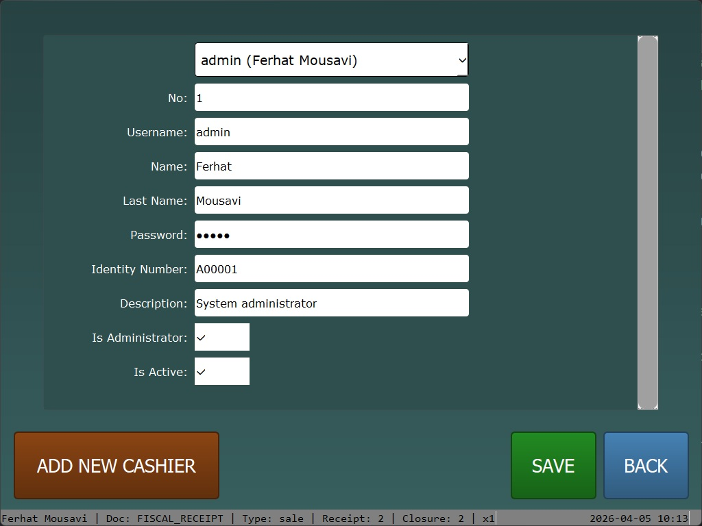

> Cashier Management form with cashier selection combobox, editable profile fields, and administrator-only **ADD NEW CASHIER** button. Field-level read-only protection enforced based on the `is_administrator` flag.

Administrators can press **ADD NEW CASHIER** to clear the panel and create a record in-place (combobox hidden until save):

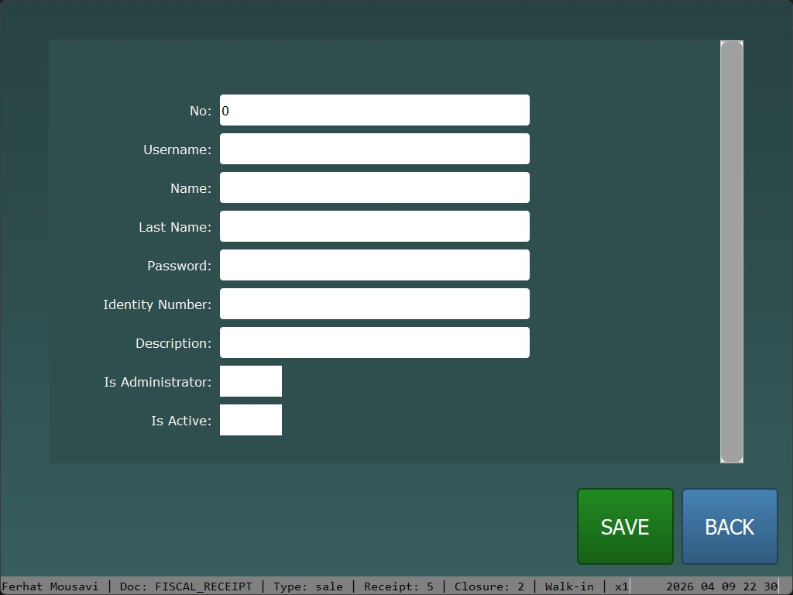

> Blank cashier entry form: No, Username, Name, Last Name, Password, Identity Number, Description, **Is Administrator**, **Is Active**, plus **SAVE** / **BACK**.

Selecting "PRODUCTS" opens the product search and listing screen:

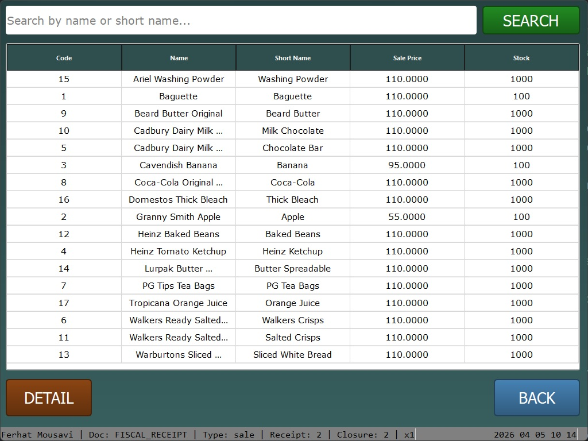

> Product List form with real-time search by name or short name, paginated DataGrid results, **DETAIL** button (bottom-left) to open the product detail view, and **BACK** button (bottom-right) to return to the Main Menu.

Clicking "DETAIL" on a selected product opens the tabbed product detail dialog:

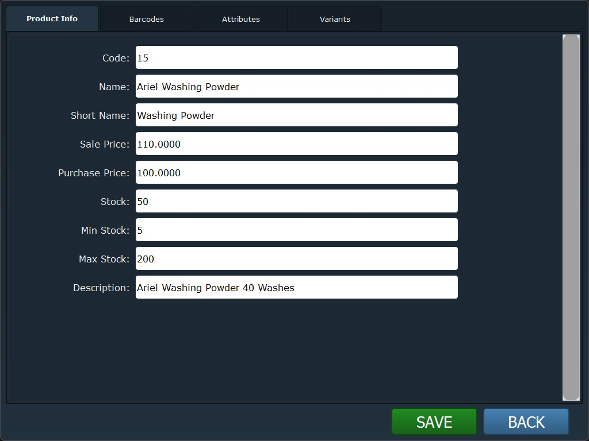

> Product Detail modal dialog (DB-driven, 1024×768) with four tabs: **Product Info** (code, name, price, stock, unit, manufacturer), **Barcodes**, **Attributes**, and **Variants**. Tabs are fully navigable via touch.

Selecting **CUSTOMER** from the Main Menu opens the customer database (management context — **DETAIL** / **ADD** / **BACK**). The same list opened from the SALE form after **FUNC** → **CUSTOMER** may show **SELECT** instead of **DETAIL** when assigning a customer to the active sale.


> Customer List with search (name, phone, e-mail), results grid, and action buttons (**DETAIL** or **SELECT**, **ADD**, **BACK** depending on context).

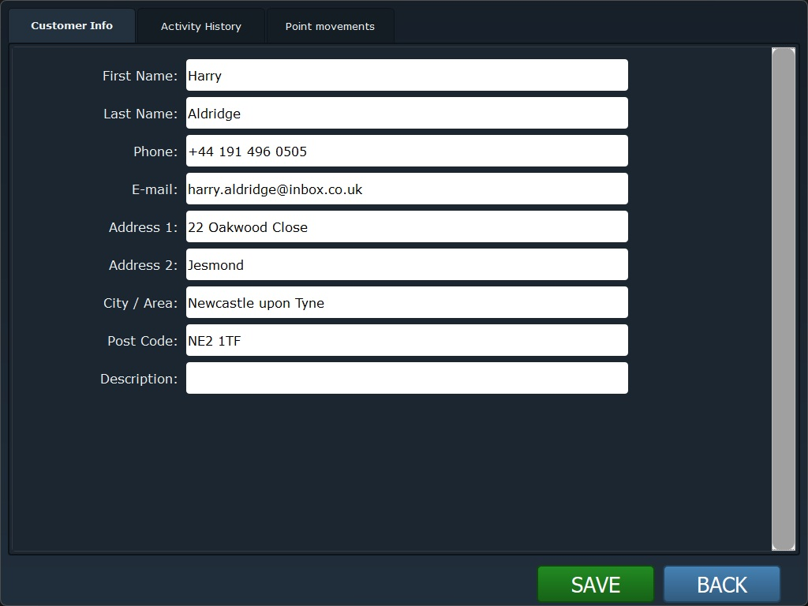

> Customer Detail modal with **Customer Info** and **Activity History** tabs; **SAVE** / **BACK** to persist or close.

Selecting "WAREHOUSE" from the Main Menu opens the warehouse stock management screen:

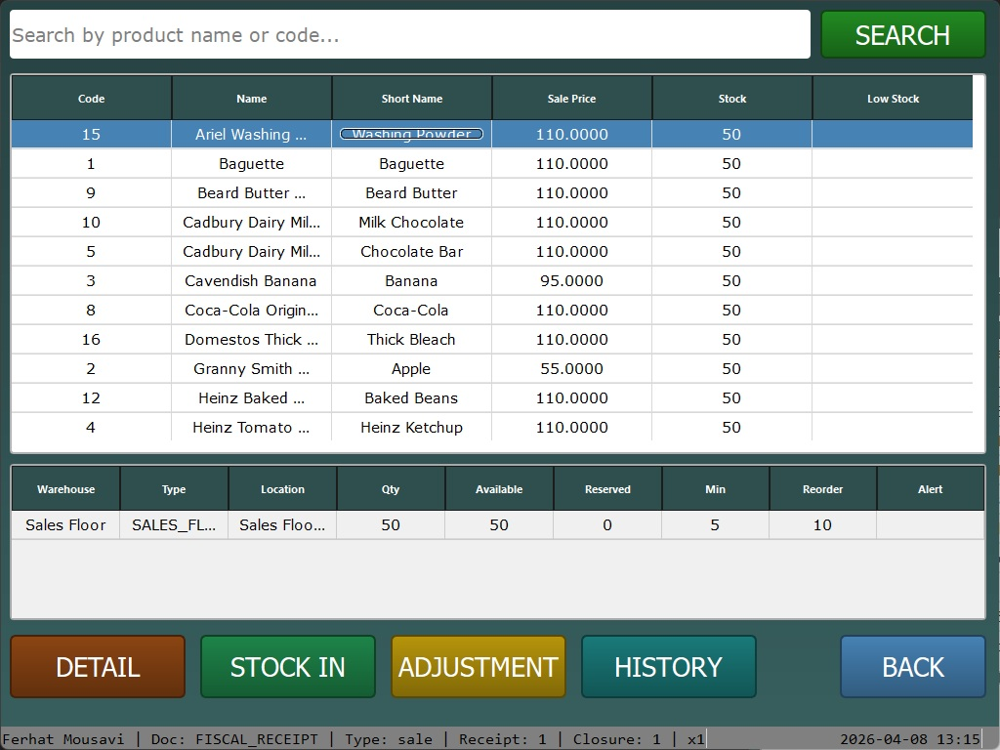

> Warehouse Stock List form showing all products with columns for Code, Name, Short Name, Sale Price, Stock, and Low Stock indicator. Selecting a product displays a per-location breakdown (Warehouse, Type, Location, Qty, Available, Reserved, Min, Reorder, Alert) in the panel below. Four action buttons are available: **DETAIL** (opens Product Detail dialog), **STOCK IN** (goods receipt), **ADJUSTMENT** (manual stock correction), and **HISTORY** (movement log).

Clicking **STOCK IN** opens the goods receipt form to record incoming stock:

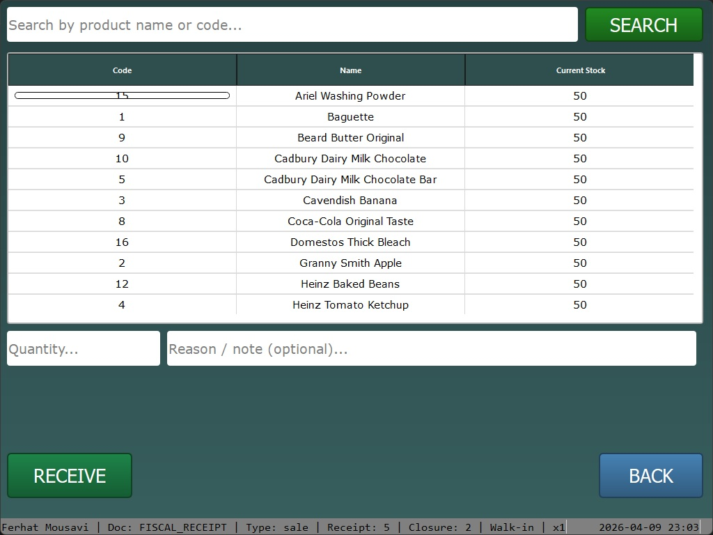

> Warehouse Stock In form with a searchable product list (Code, Name, Current Stock). Select a product, enter the received **Quantity** and an optional **Reason / note**, then press **RECEIVE** to record the stock-in movement and update inventory.

Clicking **ADJUSTMENT** opens the manual stock adjustment form:

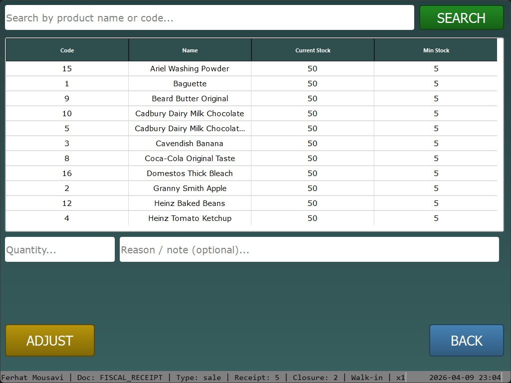

> Warehouse Adjustment form with a searchable product list (Code, Name, Current Stock, Min Stock). Select a product, enter the correction **Quantity** (positive or negative) and an optional **Reason / note**, then press **ADJUST** to record the adjustment movement and update inventory.

Clicking **HISTORY** opens the stock movement history for the selected product:

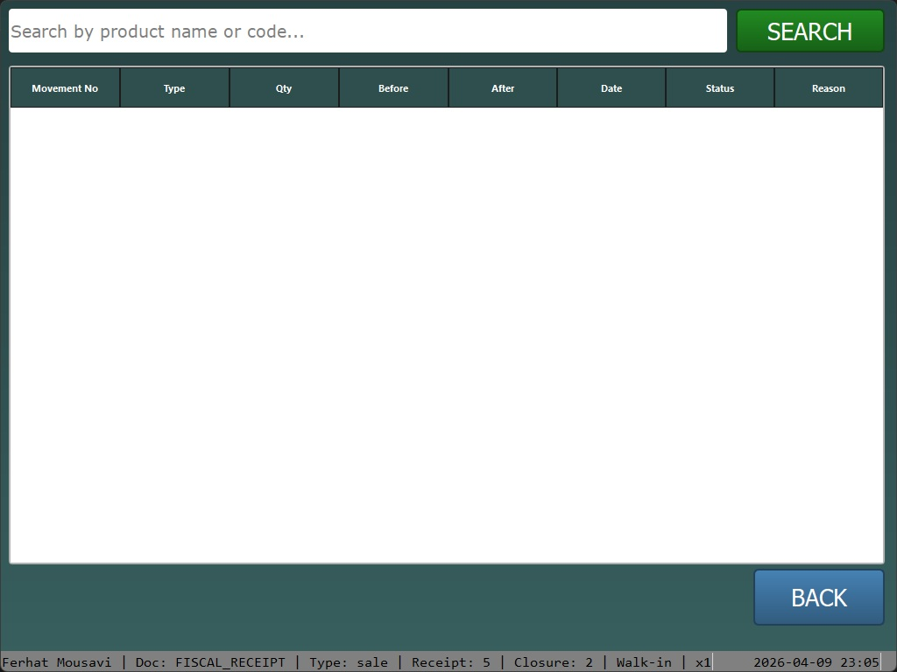

> Warehouse History form listing all stock movements for a product with columns: Movement No, Type, Qty, Before, After, Date, Status, and Reason. Use the search bar to filter movements by product name or code.

### Configuration
- Edit `settings.toml` to configure database connections and basic application settings
- **Note**: Many POS settings (hardware ports, display settings, backend connections) are now managed through the database (`PosSettings` model) and can be configured via the application UI or API
- The application uses SQLite by default, stored in `db.sqlite3`
- Device information (serial number, OS) is automatically detected and stored on first initialization

### Database Models Overview

The application includes **100+ database models** organized into logical categories:

- **Core System**: Cashier, Store, Table, Country, CountryRegion, City, District
- **Currency & Payment**: Currency, CurrencyTable, PaymentType, ClosureCurrency
- **Product Management**: Product, ProductVariant, ProductAttribute, ProductBarcode, ProductUnit, ProductManufacturer, DepartmentMainGroup, DepartmentSubGroup
- **Transaction Models**: TransactionHead/HeadTemp, TransactionProduct/ProductTemp, TransactionPayment/PaymentTemp, TransactionDiscount/DiscountTemp, TransactionTax/TaxTemp, TransactionTip/TipTemp, TransactionDepartment/DepartmentTemp, TransactionDelivery/DeliveryTemp, TransactionNote/NoteTemp, TransactionRefund/RefundTemp, TransactionSurcharge/SurchargeTemp, TransactionFiscal/FiscalTemp, TransactionKitchenOrder/KitchenOrderTemp, TransactionLoyalty/LoyaltyTemp, TransactionChange/ChangeTemp, TransactionVoid, TransactionLog, TransactionSequence, TransactionDocumentType, TransactionDiscountType, TransactionStatus
- **Warehouse Management**: Warehouse, WarehouseLocation, WarehouseProductStock, WarehouseStockMovement, WarehouseStockAdjustment
- **Customer Management**: Customer (`phone_number`, **`phone_normalized`** for loyalty), CustomerSegment, CustomerSegmentMember — **`CustomerSegmentService`** auto-assigns segment membership from **`criteria_json`** (and optional VIP flags in **`preferences_json`**), separate from loyalty tier; see [docs/42-customer-segmentation.md](docs/42-customer-segmentation.md)
- **Campaign & Promotion**: CampaignType, Campaign, CampaignRule, CampaignProduct, CampaignUsage, Coupon, CouponUsage
- **Loyalty Programs**: LoyaltyProgram, LoyaltyTier, CustomerLoyalty, LoyaltyPointTransaction, **LoyaltyProgramPolicy**, **LoyaltyEarnRule**, **LoyaltyRedemptionPolicy**
- **Cashier Performance**: CashierWorkSession, CashierWorkBreak, CashierPerformanceMetrics, CashierPerformanceTarget, CashierTransactionMetrics
- **Closure & Reporting**: Closure, ClosureCashierSummary, ClosureCurrency, ClosureDepartmentSummary, ClosureDiscountSummary, ClosureDocumentTypeSummary, ClosurePaymentTypeSummary, ClosureTipSummary, ClosureVATSummary, ClosureCountrySpecific
- **Form & UI**: Form, FormControl (supports parent-child relationships for Panel controls with generic model form pattern), FormControlTab (tab page definitions for TABCONTROL controls — linked to FormControl via FK), PosSettings, PosVirtualKeyboard, ReceiptHeader, ReceiptFooter, LabelValue

All models support:
- **UUID Primary Keys**: Unique identifiers for all records
- **CRUD Operations**: Base CRUD class provides create, read, update, delete operations
- **Audit Trails**: Created/updated timestamps and user tracking
- **Soft Delete**: Records can be marked as deleted without physical removal
- **Auto-Save**: Automatic database persistence when attributes are modified

## Development Roadmap

### Core Infrastructure
- [x] **Project Structure** - Basic application framework
- [x] **Database Layer** - SQLAlchemy ORM integration with 100+ models
- [x] **Database Structure** - POS data layer structure with comprehensive model definitions (including loyalty policy and earn/redeem configuration tables)
- [x] **UI Foundation** - PySide6 interface framework
- [x] **Auto-Save System** - Automatic database persistence with descriptor pattern
- [x] **Startup Entry-Point Guards** - Working-directory normalisation, Python version guard, single-instance file lock, global exception handler in `saleflex.py`
- [ ] **Configuration Management** - Advanced settings system
- [x] **Central Logging** - Configurable logging via `core/logger.py`; level, console, and file output driven by `settings.toml` `[logging]`; application-wide use of `get_logger(__name__)`
- [x] **Centralized Exception Handling** - Typed `SaleFlexError` hierarchy in `core/exceptions.py`; domain-specific subclasses for payment, hardware, tax, database, document, configuration, and authentication errors; all exceptions chained with `raise ... from e`

### POS Core Modules
- [x] **POS Manager Module** - Central business logic and transaction handling with document management system
- [x] **Document Management System** - Transaction lifecycle management with temp/permanent models, pending documents, and restaurant mode support
- [x] **Service Layer Architecture** - Business logic services (VatService, SaleService, PaymentService, LoyaltyService, CustomerSegmentService) for centralized calculations and operations
- [x] **Payment Processing System** - Multi-payment method processing with button name parsing, change calculation, and automatic document completion
- [x] **Event Handler System** - Comprehensive event handling with 10 specialized event handler classes (GeneralEvent, SaleEvent, PaymentEvent, ClosureEvent, ConfigurationEvent, ServiceEvent, ReportEvent, HardwareEvent, WarehouseEvent, CustomerEvent) for modular and maintainable code organization. All event handler methods use `_event` suffix (e.g., `_sales_form_event`, `_closure_event`) to avoid conflicts with properties. Customer events extended with `CUSTOMER_ADD` (create new customer) and `CUSTOMER_LIST_BACK` (context-aware BACK that assigns the chosen customer to the active sale transaction)
- [x] **Auto-Save System** - Automatic database persistence using descriptor pattern and wrapper classes (AutoSaveModel, AutoSaveDict, AutoSaveDescriptor) for seamless data integrity
- [ ] **SPU/PLU Management** - Product and pricing management
- [x] **Customer Module** - Customer list search, new-customer creation (ADD button), detail view/edit, and activity history (`CUSTOMER_ACTIVITY_GRID` populated from `TransactionHead` by `fk_customer_id` in `DynamicDialog`). **`phone_normalized`** sync and duplicate-phone validation on SAVE; search also matches normalized phone. Walk-in Customer placeholder automatically receives all unassigned transactions. Dual-function **SUB TOTAL / CUSTOMER** on SALE: **FUNC** for **CUSTOMER**, then tap; any dual use resets all dual buttons to primary labels
- [ ] **Printer Module** - Receipt and invoice printing
- [x] **Inventory Management** - Real-time stock tracking, goods receipt, manual adjustments, movement history, negative-stock control (SALES_FLOOR location)
- [x] **Item Discount / Markup Engine** - Dual-function DISC % / MARK % and DISC AMT / MARK AMT on SALE; **FUNC** switches alternate labels only; each tap runs the visible action and resets every dual button to primary; dialog with embedded keypad (no virtual keyboard), Enter to apply; strikethrough cancel + new line with recalculated VAT
- [ ] **Tax & Discount Engine** - Advanced tax calculation and discount management (bulk/basket/campaign discounts)

### Hardware Integration
- [ ] **Payment Device Integration**:
  - [ ] Card Reader Support (Chip & PIN, Contactless)
  - [ ] Mobile Payment Integration (Apple Pay, Google Pay)
  - [ ] Cash Drawer Control
  - [ ] PIN Pad Integration
- [ ] **Peripheral Device Support**:
  - [ ] Barcode Scanner Integration
  - [ ] Electronic Scale Integration
  - [ ] Receipt Printer Drivers
  - [ ] Display Pole Integration
- [ ] **Hardware Abstraction Layer** - Unified hardware communication interface

### User Interface
- [x] **Panel Control** - Scrollable container control with parent-child support for complex forms
- [x] **Parent-Child Control Relationships** - Panel controls can contain child controls (textboxes, checkboxes, labels, buttons)
- [x] **Generic Panel-Based Form Saving** - Automatic model updates from panel textbox and checkbox values on SAVE button click. Works with any model via naming convention (panel name = model name, control name = model field). Automatically loads model data into form and saves changes to database
- [x] **Cashier Management Form** - Role-aware cashier management with `CASHIER_MGMT_LIST` combobox for multi-cashier selection, `editing_cashier` session tracking, and field-level read-only enforcement based on `is_administrator` flag
- [x] **Add New Cashier (Admin Only)** - `ADD_NEW_CASHIER` button on CASHIER form visible only to administrators. Clears panel textboxes in-place, hides combobox and button during entry. On save, cache is updated and form redraws with new cashier pre-selected. Includes `_is_adding_new_cashier` session flag for lifecycle management
- [ ] **Dynamic Interface Interpreter** - Flexible UI rendering system
- [ ] **Interface Functions** - Core UI interaction handlers
- [ ] **Tables Layout Module** - Restaurant table management
- [ ] **Screen Designer App** - Custom interface design tool
- [ ] **Multi-Display Support** - Customer and cashier display management
- [x] **Touch Optimization** - Enhanced touch screen experience with 30px scrollbars for Panel controls

### Business Features
- [ ] **Campaign & Promotion Management**:
  - [ ] Multiple Campaign Types (Product Discount, Basket Discount, Time-Based, Buy X Get Y, Welcome Bonus)
  - [ ] Flexible Discount Rules (Percentage, Fixed Amount, Free Product)
  - [ ] Time-Based Restrictions (Date Range, Daily Hours, Days of Week)
  - [ ] Product/Category/Brand/Payment Type Filters
  - [ ] Usage Limits & Priority Rules
  - [ ] Customer Segment Targeting (campaign UI / rule designer)
  - [x] Automatic **segment membership** from `CustomerSegment.criteria_json` plus **`marketing_profile()`** to combine segment codes with loyalty tier code (`CustomerSegmentService`; sync on completed sale and customer save)
  - [ ] Coupon Generation & Management (QR Code, Barcode Support)
  - [ ] Campaign Usage Tracking & Analytics
- [ ] **Loyalty Program Management** (partial — local enrollment and policy schema; see [docs/41-loyalty-programs.md](docs/41-loyalty-programs.md)):
  - [x] `LoyaltyProgramPolicy`, `LoyaltyEarnRule`, `LoyaltyRedemptionPolicy` models and seed rows with default program
  - [x] Phone-first customer identity (`phone_normalized`, `LoyaltyService.normalize_phone`, policy default country code)
  - [x] Tiered membership seed (`LoyaltyTier`: Bronze, Silver, Gold, Platinum) and `CustomerLoyalty` auto-creation on sale customer assignment; `TransactionHeadTemp.loyalty_member_id`; welcome points + `LoyaltyPointTransaction` (`WELCOME`) when configured
  - [x] Points **earning** at checkout (`LoyaltyEarnService`: document net + tier multiplier; rules: `DOCUMENT_TOTAL`, `LINE_ITEM`, `CATEGORY`/`DEPARTMENT`, `PRODUCT_SET`/`BUNDLE`; `LoyaltyPointTransaction` `EARNED`, `TransactionLoyalty`)
  - [x] Points **redemption** in payment flow (`LoyaltyRedemptionService`, `BONUS_PAYMENT`, `LOYALTY` discount type, `REDEEMED` ledger; void/refund clawback stub)
  - [ ] Point expiry enforcement job
  - [x] Tier reassignment from `lifetime_points` and calendar-year `annual_spent` after each completed sale (`LoyaltyService`); also on enrollment / sale assignment for existing members
  - [ ] Tier **discount** percentage applied automatically at sale time (multiplier already used in earn engine)
  - [ ] Birthday bonus automation
  - [x] Point history / audit on customer screen (**Point movements** tab, `CUSTOMER_LOYALTY_POINTS_GRID`; startup patch `ensure_customer_loyalty_points_grid` for existing DBs)
  - [x] Customer segmentation rules **independent** of loyalty tables (seed segments + auto assignment); combined only in **`marketing_profile`**
  - [ ] GDPR consent workflows beyond existing customer consent fields
- [ ] **Reports Module** - Comprehensive business analytics
- [ ] **Employee Management** - Staff scheduling and performance tracking
- [ ] **Returns & Exchanges** - Product return and exchange handling
- [ ] **Multi-Store Support** - Chain store management capabilities

### Warehouse & Inventory Management
- [x] **Inventory Control**:
  - [x] Real-time Stock Tracking (SALES_FLOOR location)
  - [x] Automatic stock deduction on sale completion
  - [x] Negative-stock policy enforcement per product
  - [x] Stock inquiry UI (per-product, per-location breakdown)
  - [x] Goods receipt / stock-in form
  - [x] Manual stock adjustment form
  - [x] Stock movement history form
  - [x] Low-stock alerts during sales
  - [x] Stock restoration on sale cancellation / void
- [ ] **Advanced Inventory Control**:
  - [ ] Multi-Location Inventory Management (full transfer workflow)
  - [ ] Automatic Reorder Points & Purchase Orders
- [ ] **Warehouse Operations**:
  - [ ] Pick & Pack Operations
  - [ ] Cycle Counting & Physical Inventory
  - [ ] Batch & Serial Number Tracking
- [ ] **Supply Chain Management**:
  - [ ] Vendor Management & Purchase Orders
  - [ ] Supplier Performance Analytics
  - [ ] Automated Procurement Workflows
  - [ ] Cost Analysis & Optimization
- [ ] **Inventory Analytics**:
  - [ ] ABC Analysis (Fast/Slow Moving Items)
  - [ ] Demand Forecasting
  - [ ] Inventory Turnover Reports
  - [ ] Wastage & Shrinkage Tracking

### Sector-Specific Features
- [ ] **Restaurant Management**:
  - [ ] Recipe & Ingredient Management
  - [ ] Kitchen Display System (KDS)
  - [ ] Table Management & Reservations
  - [ ] Menu Engineering & Cost Analysis
  - [ ] Food Safety & Expiration Tracking
- [ ] **Retail Store Management**:
  - [ ] Category & Brand Management
  - [ ] Size & Color Variations
  - [ ] Seasonal Pricing & Promotions
  - [ ] Customer Shopping Behavior Analytics
  - [ ] Planogram & Shelf Management
- [ ] **Fashion & Boutique**:
  - [ ] Size Matrix & Style Variations
  - [ ] Fashion Season Management
  - [ ] Consignment & Vendor Management
  - [ ] Trend Analysis & Buying Recommendations
  - [ ] Alteration & Custom Order Tracking
- [ ] **Grocery & Supermarket**:
  - [ ] Fresh Produce Management
  - [ ] Deli & Bakery Operations
  - [ ] Bulk Item Management
  - [ ] Supplier & Private Label Management
  - [ ] Perishable Item Rotation (FIFO/LIFO)

### Integration & Connectivity
- [x] **Integration Layer Architecture** (`pos/integration/`): Two-tier design — SaleFlex.GATE as primary hub with third-party direct connectors (ERP, payment, campaign). `ExternalDevice` base stub, `hooks.py` glue, `IntegrationMixin` routing. See [docs/40-integration-layer.md](docs/40-integration-layer.md)
- [x] **Offline Outbox Pattern** (`SyncQueueItem` model): Every event queued locally before transmission — zero data loss during connectivity gaps
- [x] **Background Sync Worker** (`pos/manager/sync_worker.py`): PySide6 `QThread` worker for non-blocking periodic push/pull cycles
- [x] **Integration Exception Hierarchy**: `GATEConnectionError`, `GATEAuthError`, `GATESyncError`, `GATENotificationError`, `ERPConnectionError`, `ThirdPartyPaymentError`, `ThirdPartyCampaignError`
- [ ] **SaleFlex.GATE Integration** (stub → implementation):
  - [ ] GateClient HTTP transport (requests, retry, timeout)
  - [ ] GateAuth JWT token acquisition and renewal
  - [ ] GateSyncService: push transactions, closures, warehouse movements
  - [ ] GatePullService: pull product/price updates, campaign definitions
  - [ ] Notification polling: terminal messages, cache-refresh signals
  - [ ] Multi-Store Management
  - [ ] Cloud-Based Remote Access & Real-time Analytics
- [ ] **Third-Party Direct Connectors** (stub → implementation):
  - [ ] ERP adapters (SAP, Oracle, Logo, Netsis, custom)
  - [ ] Payment gateway adapters (iyzico, PayTR, Stripe, Nets, custom)
  - [ ] Campaign module adapters (custom)
- [ ] **Offline/Online Mode** - Seamless switching between online and offline operations

### Security & Authentication
- [ ] **User Authentication System** - Multi-level user access control
- [ ] **Data Encryption** - Secure data storage and transmission
- [ ] **Audit Trail** - Comprehensive transaction logging
- [ ] **Role-Based Access Control** - Granular permission management
- [ ] **PCI DSS Compliance** - Payment industry security standards

### Performance & Scalability
- [x] **In-Memory Data Caching** - Reference data (`pos_data`) and product data (`product_data`) loaded once at startup to minimize disk I/O
- [x] **Product Data Cache** - All product-related models (including Currency, CurrencyTable, and Vat) cached in memory for fast sale operations, currency calculations, VAT lookups, and button rendering
- [x] **Active Closure Management** - Current closure data maintained in session memory (`CurrentData.closure`) with automatic loading at startup and lifecycle management (open → active → closed)
- [x] **Auto-Save Optimization** - Automatic database persistence reduces manual save operations and ensures data integrity without performance overhead
- [ ] **Database Optimization** - Query optimization and indexing
- [ ] **External Caching Layer** - Redis/Memcached integration (optional)
- [ ] **Load Testing** - Performance testing under high load
- [x] **Memory Management** - Efficient resource utilization via pos_data and product_data caches
- [ ] **Concurrent Transaction Handling** - Multi-terminal support

### Data Management
- [ ] **Data Migration Tools** - Database upgrade and migration utilities
- [ ] **Backup & Recovery** - Automated backup and restore systems
- [ ] **Data Export/Import** - CSV, Excel, and API data exchange
- [ ] **Data Archiving** - Long-term data storage solutions

### Localization & Compliance
- [ ] **Multi-Language Support** - Internationalization (i18n)
- [x] **Currency Support** - Multi-currency handling with exchange rate tracking
- [x] **Tax Compliance** - Country-specific tax regulations with VAT/tax rate management
- [ ] **Fiscal Printer Support** - Government-mandated receipt requirements
- [x] **Local Regulations** - Region-specific compliance features via `ClosureCountrySpecific` model with template-based initialization (supports Turkey E-Fatura, USA state taxes, EU VAT reporting, etc.)
- [x] **Region Management** - `CountryRegion` model for tracking states/provinces/special zones with ISO 3166-2 compliant fields. Includes 80+ pre-populated regions (US states, CA provinces, DE states, FR regions) and integration with closure templates
- [x] **ISO 3166 Compliance** - Country and region models use ISO 3166-1 (alpha-2, alpha-3, numeric) and ISO 3166-2 (subdivision codes) standard field names for international compatibility

## Documentation

Comprehensive documentation is available in the `docs/` directory:

| Document | Description |
|----------|-------------|
| **[Documentation Index](docs/README.md)** | Complete guide organized by topic |
| **[Installation Guide](docs/03-installation.md)** | Step-by-step setup (Python, venv, pip, first run) |
| **[Configuration](docs/04-configuration.md)** | `settings.toml` + tabbed SETTING (POS + loyalty) |
| **[First Login](docs/05-first-login.md)** | Default credentials, role differences, document recovery |
| **[Virtual Keyboard](docs/06-virtual-keyboard.md)** | DB-driven keyboard themes, enable/disable, custom themes |
| **[Sale Transactions](docs/10-sale-transactions.md)** | NumPad modes, adding products, payments, item actions |
| **[Suspend and Resume](docs/11-suspend-resume.md)** | SUSPEND button, parked carts, market mode |
| **[Cancellations](docs/12-cancellations.md)** | Line cancellation (DELETE), full document cancellation (CANCEL) |
| **[End-of-Day Closure](docs/13-end-of-day-closure.md)** | Authorization, aggregation flow, sequence management |
| **[Cashier Management](docs/14-cashier-management.md)** | Create/edit cashiers, role permissions, ADD NEW CASHIER |
| **[Product Management](docs/15-product-management.md)** | Product List search, Product Detail tabbed dialog |
| **[Customer Management](docs/17-customer-management.md)** | Customer list, detail, phone normalization, activity + **Point movements** loyalty audit, sale assignment, segment sync on save/sale |
| **[Project Structure](docs/20-project-structure.md)** | Folder layout, class chain, startup sequence, design patterns |
| **[Database Models](docs/21-database-models.md)** | 100+ models organized by domain, temp/permanent split |
| **[Dynamic Forms System](docs/22-dynamic-forms-system.md)** | DB-driven UI forms, Panel controls, generic save pattern |
| **[UI Controls Catalog](docs/23-ui-controls.md)** | All custom Qt widgets: Button, TextBox, NumPad, SaleList, TabControl |
| **[Event System](docs/24-event-system.md)** | EventHandler, event_distributor(), all event categories |
| **[Service Layer](docs/25-service-layer.md)** | VatService, SaleService, PaymentService, LoyaltyEarnService, LoyaltyRedemptionService, LoyaltyService, loyalty_settings_model (SETTING form), CustomerSegmentService |
| **[Document Management](docs/26-document-management.md)** | Transaction lifecycle, suspend/resume, payment flow |
| **[Data Caching](docs/27-data-caching.md)** | pos_data / product_data caches, AutoSave system |
| **[Peripherals](docs/30-peripherals.md)** | OPOS-style device layer (cash drawer, printer, display) |
| **[Central Logging](docs/31-logging.md)** | `core/logger.py` configuration, log format, usage patterns |
| **[Exception Handling](docs/32-exception-handling.md)** | `SaleFlexError` hierarchy, usage patterns, design guidelines |
| **[Database Initialization](docs/33-database-initialization.md)** | Seed data functions, initialization order |
| **[Startup Entry Point](docs/34-startup-entry-point.md)** | Working-dir fix, Python version guard, single-instance lock |
| **[Troubleshooting](docs/35-troubleshooting.md)** | Common issues, database problems, closure and sale issues |
| **[Support and Resources](docs/36-support.md)** | GitHub, issue tracker, donations, license |
| **[Integration Layer](docs/40-integration-layer.md)** | GATE hub, third-party connectors, offline outbox, SyncWorker, notification system |
| **[Loyalty Programs](docs/41-loyalty-programs.md)** | Earn + redeem (BONUS), policy models, `EARNED`/`REDEEMED`, customer **Point movements** audit grid, closure receipt loyalty summary, payment-type earn filter in `settings_json` |
| **[Customer Segmentation](docs/42-customer-segmentation.md)** | Auto segment membership, `criteria_json`, VIP preferences, `marketing_profile` vs loyalty tier |

## Contributing

We welcome contributions to SaleFlex.PyPOS! Please read our contributing guidelines and feel free to submit issues, feature requests, or pull requests.

## License

This project is licensed under the MIT License. See the [LICENSE](LICENSE) file for details.

## Contributors

<table>
<tr>
    <td align="center">
        <a href="https://github.com/ferhat-mousavi">
            
            <br />
            <sub><b>Ferhat Mousavi</b></sub>
        </a>
    </td>
</tr>
</table>

## Support & Donations

If you find SaleFlex.PyPOS valuable and want to support its development, you can contribute through cryptocurrency donations:

- **USDT**: `0xa5a87a939bfcd492f056c26e4febe102ea599b5b`
- **BUSD**: `0xa5a87a939bfcd492f056c26e4febe102ea599b5b`
- **BTC**: `184FDZ1qV2KFzEaNqMefw8UssG8Z57FA6F`
- **ETH**: `0xa5a87a939bfcd492f056c26e4febe102ea599b5b`
- **SOL**: `Gt3bDczPcJvfBeg9TTBrBJGSHLJVkvnSSTov8W3QMpQf`

Your support helps us continue developing new features and maintaining this open-source project.

---

**For more information about the SaleFlex ecosystem, visit [SaleFlex.GATE](https://github.com/SaleFlex/SaleFlex.GATE) for centralized management capabilities.**
